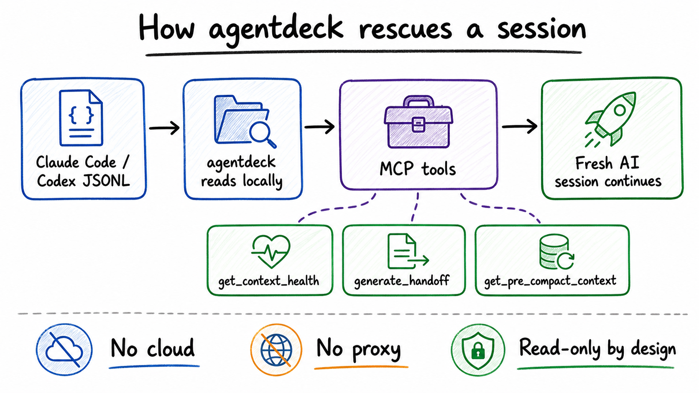

# agentdeck

AI coding sessions do not only get long. They lose working memory after
`/compact`.

agentdeck is a local-first session rescue layer for Claude Code and Codex
power users. It reads the JSONL files your AI coding tools already write,
shows when a session is drifting or bloated, recovers context that `/compact`
buried, and generates a clean handoff prompt for a fresh session.

No cloud. No proxy. No telemetry. Read-only by design.


## The Problem

When an AI coding session gets too large, you usually have two bad options:

- keep going in a bloated session where the assistant rereads files, repeats
  failed commands, and loses focus;
- run `/compact`, which shrinks the live context but buries exact decisions,
  files, failures, and reasoning inside a summary.

agentdeck gives the AI a way to inspect the raw local session history again.
That turns "I lost the thread" into "recover the important context and continue
cleanly."

## Real Evidence

This is from a local `agentdeck audit-sessions --limit 20` run on real Claude
Code and Codex transcripts:

```text
Claude sessions sampled: 20
Token accuracy vs raw JSONL: 19/19 matched, 100%
/compact events found: 9
Sessions affected: 4
Context compacted away: ~3.3M tokens

One real session:
Before /compact: 538,831 tokens
After /compact:   14,875 tokens
Compression:      36x
```

That is the core use case: the details still exist in the local JSONL, but the
current AI session no longer has them in live context. agentdeck exposes those
details through a small MCP tool surface.

## How It Works



agentdeck runs in two complementary modes:

- **Local web cockpit**: browse sessions, search messages, inspect token usage,
  and copy safe resume commands.
- **MCP session rescue server**: lets Claude Code ask agentdeck for context
  health, pre-compact recovery, and handoff prompts.

The MCP server does not require the daemon. It reads JSONL directly so it can
answer from the latest on-disk session state.

## MCP Tools

| Tool | What it solves | When to use it |
|---|---|---|
| `list_sessions` | Finds candidate sessions for the current project | When multiple terminals or resumes exist |
| `get_context_health` | Classifies a session as `healthy`, `drifting`, `risky`, or `rescue_now` | Before compacting or continuing a long task |
| `generate_handoff` | Produces a deterministic Markdown handoff prompt | When starting a fresh AI session |
| `get_pre_compact_context` | Recovers messages immediately before the last `/compact` | When the compact summary lost important details |

Example MCP request flow:

```text
User: "This session feels lost. Should I compact or restart?"

AI calls get_context_health
→ agentdeck reports context fill, repeated reads, failed command loops, bloat

AI calls generate_handoff
→ agentdeck returns files touched, commands run, known failures, recent task,
  and last useful exchanges

User starts fresh session
→ fresh AI continues with the recovered context instead of guessing
```

## Install

Build from source:

```sh
git clone https://github.com/klyne-ai/klyne
cd agentdeck
GOTOOLCHAIN=auto CGO_ENABLED=0 go build -o ./bin/agentdeck ./cmd/agentdeck
./bin/agentdeck start
```

Then open:

```text
http://127.0.0.1:7878
```

To run the MCP server:

```sh
agentdeck mcp
```

Example Claude Code MCP config:

```json
{
  "mcpServers": {
    "agentdeck": {
      "command": "agentdeck",
      "args": ["mcp"]
    }
  }
}
```

## Quick Start

1. Build and start agentdeck.
2. Open `http://127.0.0.1:7878`.
3. Run `agentdeck audit-sessions --limit 20` to verify the local trust
   foundation.
4. Add `agentdeck mcp` to Claude Code.
5. In a long Claude Code session, ask: "Use agentdeck to check whether this
   session should continue, compact, or restart."

## What You Get

- **Context health**: a deterministic classifier for long-session risk.
- **Bloat scorecard**: top files, commands, and tool outputs contributing to
  context noise.
- **Pre-compact recovery**: raw messages before the latest `/compact` boundary.
- **Handoff prompts**: clean restart prompts built from transcript ground truth.
- **Session search**: local FTS over historical AI coding conversations.
- **Resume commands**: copy-safe `claude --resume` and Codex recovery commands
  from the correct project directory.
- **Audit reports**: compare stored metrics against raw JSONL so the numbers
  are not trusted blindly.

## Supported CLIs

| CLI | Status | Data source |
|---|---:|---|
| Claude Code | Primary | `~/.claude/projects/**/*.jsonl` |
| Codex | Partial | `~/.codex/sessions/YYYY/MM/DD/rollout-*.jsonl` |

Claude Code is the primary launch path for MCP rescue tools. Codex transcript
discovery and audit reporting exist, but full MCP parity is still in progress.

## Privacy Model

agentdeck is local-first:

- reads local JSONL transcripts;
- stores local SQLite data;
- binds the web UI to `127.0.0.1`;
- never uploads or proxies conversations;
- never writes to the source transcript files.

Optional AI features require your own provider key. Core audit and MCP rescue
features are deterministic and do not require an AI API key.

## Current Limitations

- MCP rescue tools are launch-ready for Claude Code first; Codex support is
  still being completed.
- The classifier thresholds are deterministic heuristics, not a labelled
  benchmark yet.
- Very large JSONL lines need scan-error handling before the MCP result should
  be treated as fully authoritative.
- Release binaries, Homebrew, and one-command install are not shipped yet.
- The full test suite currently has unrelated red tests around cost default
  grouping and migration-count expectations.

## Roadmap

1. Finish Codex MCP parity or explicitly gate Codex out of MCP v1.
2. Add a labelled context-health eval suite, similar to benchmark reports in
   code-review-graph.
3. Ship release binaries and a one-command installer.
4. Add README/demo fixtures so users can try the rescue flow without existing
   local transcripts.
5. Add optional code-review-graph enrichment when `.code-review-graph/` exists.

## Documentation

- [MCP ship log](docs/MCP-SHIP-LOG.md)
- [Context rescue strategy](docs/marketing/context-rescue-strategy.md)
- [Comparison and gaps](docs/marketing/comparison-and-gaps.md)
- [Security model](docs/SECURITY.md)

## License

MIT. See [LICENSE](LICENSE).
