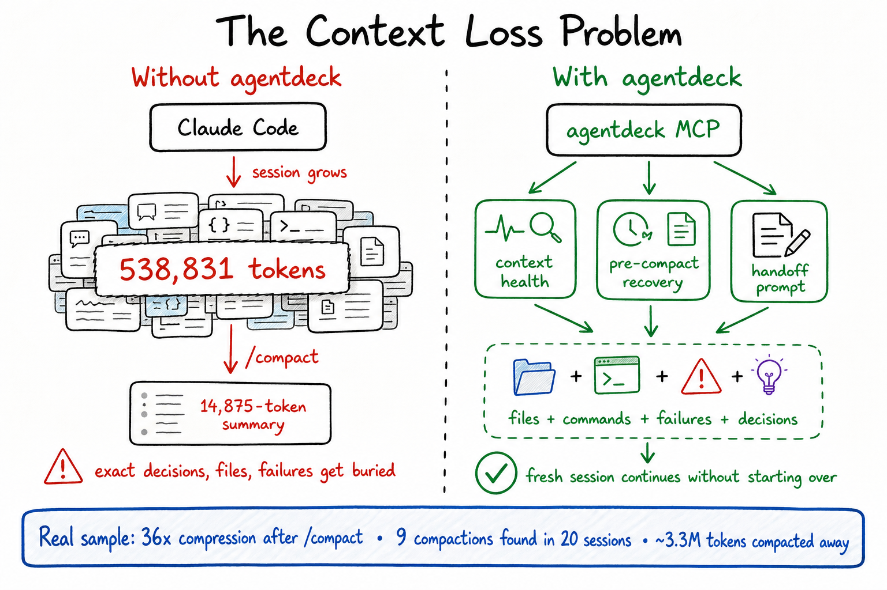

# klyne

> **The source of truth for what your AI session has actually done — including the parts the AI itself can no longer see.**

klyne is a local-first session rescue layer for Claude Code and Codex power users. It reads the JSONL files your AI coding tools already write — and gives you back the context that `/compact`, rate-limits, and fresh sessions destroy.

No cloud. No proxy. No telemetry. Read-only by design.



---

## The two problems klyne solves

These are the two pains every Claude Code / Codex power user hits weekly. **Each claim below is backed by a reproducible Go test** under [`docs/proof/`](docs/proof/) — run `make proof` and watch them pass against real fixtures.

### 1. After `/compact`, your AI has lost context. klyne recovers it.

Anthropic's 5-hour rate-limit window doesn't end when you hit a hard limit — it ends earlier, when each turn becomes prohibitively expensive because the full conversation is being re-fed to the model. `/compact` is the official escape hatch, but it permanently deletes the original turns from the AI's view. The post-compact summary often misses the specifics that mattered: exact file paths, the regex literal you and the AI debugged, the off-the-cuff observation that turned out to be the bug.

**klyne's `get_pre_compact_context` reads the JSONL bytes the AI no longer has access to.** Same session, same transcript on disk, but klyne can return content the AI's view literally does not contain.

> **Proof:** [`docs/proof/01-compact-recovery/`](docs/proof/01-compact-recovery/) — synthetic Claude session about a bank-SMS regex bug. Twelve pre-compact messages, a `/compact`, two post-compact messages. The test asserts that high-signal strings (file paths, the user-verified `XX1234` mask, the exact npm command, the test result) appear in klyne's recovery output AND do **not** appear anywhere in the post-compact lines. **1165 bytes of conversational context recovered per fixture run** — content the AI would otherwise need re-input to know about.

### 2. Vanilla Claude's "summarise what we did" is variable; klyne's handoff is deterministic.

When you hit the rate-limit and need to bootstrap a fresh session, you typically ask the AI: *"summarise what we just did so I can paste it into a new chat."* That paragraph reads fine, but it varies turn-to-turn, glosses over the file paths and command stems the new session actually needs, and burns input tokens on something the AI already knows.

**klyne's `generate_handoff` reads the JSONL transcript and emits a structured Markdown prompt with fixed sections** — same input always produces the same output, every section a structured pull from the actual session events. Project path, files touched (with reuse counts), commands run, known failures, recent exchanges verbatim.

> **Proof:** [`docs/proof/02-handoff-equivalence/`](docs/proof/02-handoff-equivalence/) — synthetic webhook-retry session paused mid-task. Three assertions: every structural section is present and populated; rendering twice produces byte-identical output; files touched 3 times are marked `(×3)` so the new session knows which file is central. **Side-by-side with vanilla Claude's likely output is rendered in the claim doc.**

---

## See the proof yourself

```bash
# Clone, build, and run the reproducible proof
git clone https://github.com/klyne-ai/klyne && cd klyne
make build
make proof
```

`make proof` runs every test under `docs/proof/`. Each scenario has a fixture you can `cat`, a Go test you can read, and a `claim.md` with the exact side-by-side. **If any claim ever stops holding, the test fails red.** Marketing and code stay locked together by design.

---

## Real evidence (from your machine)

Once installed, run klyne against your own Claude/Codex transcripts:

```bash
klyne audit-sessions --limit 20
```

A real run on this maintainer's transcripts:

```text
Claude sessions sampled: 20
Token accuracy vs raw JSONL: 19/19 matched, 100%
/compact events found: 9
Sessions affected: 4
Context compacted away: ~3.3M tokens

One real session:
  Before /compact: 538,831 tokens
  After /compact:   14,875 tokens
  Compression:      36×
```

That ~3.3M tokens of "compacted away" context is exactly what `get_pre_compact_context` reads back from the JSONL.

---

## How it works


klyne runs in two complementary modes:

- **Local web cockpit** at `http://127.0.0.1:7878` — browse sessions, search messages across every project, inspect token usage, copy safe resume commands.
- **MCP session rescue server** — Claude Code (and Codex CLI) spawn it as a subprocess. The AI itself can call klyne's tools mid-session.

The MCP server is independent of the daemon. It reads JSONL directly so it works in fresh sessions before the daemon has had a chance to ingest them. **Only one tool — `search_messages` — depends on the daemon, because full-text search needs SQLite.**

---

## Install

```bash
# Build from source (requires Go 1.25+)
git clone https://github.com/klyne-ai/klyne && cd klyne
make build

# Register the MCP server in Claude Code and/or Codex configs.
# Idempotent: safe to re-run on every binary upgrade.
./bin/klyne mcp install

# Start the daemon + open the web UI
./bin/klyne
```

The `mcp install` command auto-detects host configs:

| Host | Config | Entry written |
|---|---|---|
| Claude Code | `~/.claude.json` | `mcpServers.klyne` |
| Codex CLI | `~/.codex/config.toml` | `[mcp_servers.klyne]` |

It also removes any legacy `agentdeck` entry from those configs (klyne was renamed from agentdeck during early development). Pass `--platform claude` or `--platform codex` to scope the install.

---

## MCP surface

### Tools (auto-invoked by the AI)

| Tool | What it solves | When to use it |
|---|---|---|
| `list_sessions` | Enumerates Claude + Codex sessions in this project | Disambiguate between parallel terminals or `--resume` invocations |
| `get_context_health` | Classifies a session as `healthy` / `drifting` / `risky` / `rescue_now` plus a bloat scorecard | Before compacting or continuing a long task |
| `search_messages` | Full-text search across every indexed session | "Where did we discuss X two weeks ago?" — requires daemon running |
| `generate_handoff` | Deterministic Markdown handoff prompt for fresh sessions | When you've hit your rate-limit and need to start over |
| `get_pre_compact_context` | Recovers messages preceding the last `/compact` (Claude) or `replacement_history` (Codex) | When the compact summary lost important details |

### Slash prompts (user-triggered via `/` menu in Claude Code)

| Slash command | What it runs |
|---|---|
| `/mcp__klyne__health` | Live `get_context_health` |
| `/mcp__klyne__sessions` | Live `list_sessions` |
| `/mcp__klyne__search` | Live `search_messages` (takes a `query` argument) |
| `/mcp__klyne__handoff` | Live `generate_handoff` |
| `/mcp__klyne__precompact` | Live `get_pre_compact_context` |

The prompts run server-side and inject the result as user-message content — no AI roundtrip needed for the fetch.

---

## Supported CLIs

| CLI | Tools | Search | Pre-compact recovery |
|---|---|---|---|
| Claude Code | All 5 tools | ✅ | ✅ via `compact_boundary` lines |
| Codex | All 5 tools | ✅ | ✅ via embedded `replacement_history` |

For Codex sessions, `pre_tokens` and `trigger` (manual/auto) fields are not exposed in the output — Codex's `compacted` envelope doesn't carry that metadata. The recovered messages themselves are returned identically.

---

## What klyne does *not* claim

To stay honest:

- **klyne does NOT reduce Claude's per-turn token cost.** It doesn't intercept the AI loop.
- **klyne does NOT save a guaranteed % of your rate-limit budget.** The savings depend on whether you would otherwise have re-explained the lost context — varies by user and session.
- **klyne does NOT replace `/compact`.** Use `/compact` when you need it; klyne lets you survive it without losing recoverable context.
- **klyne does NOT call any AI model in the core flow.** Every tool here is deterministic over JSONL bytes. The optional summary/title features in the web UI are BYOK and clearly gated.

---

## Privacy model

klyne is local-first:

- reads local JSONL transcripts;
- stores local SQLite data under `~/.klyne/`;
- binds the web UI to `127.0.0.1`;
- never uploads or proxies conversations;
- never writes to the source transcript files.

Optional AI features (summary, title generation, etc.) require your own provider key. Core audit, MCP rescue, search, and handoff features are deterministic and do not require an AI API key.

---

## Quick start

1. **Build:** `make build` (binary lands at `./bin/klyne`)
2. **Install MCP:** `./bin/klyne mcp install`
3. **Restart Claude Code** so it picks up the new MCP server + slash prompts
4. **Run the daemon:** `./bin/klyne` (opens `http://127.0.0.1:7878` in your browser)
5. **In a long session, ask Claude:** *"Use klyne to check whether this session should continue, compact, or restart."*
6. **Verify trust:** `./bin/klyne audit-sessions --limit 20` (compares klyne's stored metrics against raw JSONL)

---

## Documentation

- [Reproducible proof index](docs/proof/) — every claim, with a fixture and a Go test
- [Compact-recovery proof](docs/proof/01-compact-recovery/claim.md) — side-by-side vs vanilla Claude
- [Handoff-equivalence proof](docs/proof/02-handoff-equivalence/claim.md) — verbatim handoff output
- [MCP ship log](docs/MCP-SHIP-LOG.md) — every slice that landed, in order
- [Context rescue strategy](docs/marketing/context-rescue-strategy.md)
- [Comparison and gaps](docs/marketing/comparison-and-gaps.md)
- [Security model](docs/SECURITY.md)

---

## Roadmap

1. ~~Codex MCP parity~~ — ✅ shipped (slice 4)
2. ~~Cross-session full-text search~~ — ✅ shipped (slice 5)
3. ~~Reproducible proof artifacts~~ — ✅ shipped (this slice)
4. **`suggest_session_name`** — generate a meaningful name from JSONL for Claude Code's "rename" UI (queued)
5. **Labelled context-health eval suite** — move classifier thresholds from heuristics to data
6. **Release binaries** + Homebrew tap + one-command installer
7. Optional [code-review-graph](https://github.com/tirth8205/code-review-graph) enrichment when `.code-review-graph/` exists in the repo

---

## License

MIT. See [LICENSE](LICENSE).
