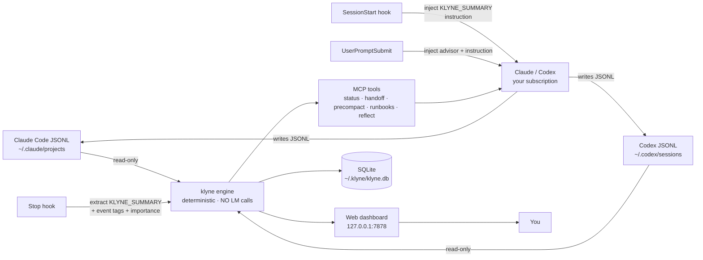

# klyne

> **See what you actually shipped this week — across every Claude Code and Codex session you've ever run, all on your laptop.**

```
Last 7 days · 41 sessions · 22h 14m focus · 14 commits · 3 PRs merged
  Top file        internal/worklog/richentry/merge.go  ·  9 edits · 2 reverts
  Top decision    "drop daemon-side LM calls, route synthesis through user's session"  (sess 0dbab5d)
  Spend           $9.40 · 6 sessions = 71% of it · 94% cache hit
  Cross-CLI mix   Claude Code 82%  ·  Codex 18% of turns

Today's high-signal sessions (importance ≥ 7): 4 of 11
  ★8  klyne          14:02 (38m)  SessionStart hook + KLYNE_SUMMARY extractor → e2e green
  ★9  oms-service    11:30 (51m)  Decided invoice v2 → v3; migration 037 behind flag
  ★7  operations-app 09:14 (22m)  Replicated customer-lens edit affordance in header
  ★7  klyne          08:47 (19m)  Deleted ~7.8K LoC of daemon-side AI plumbing

  + 7 low-signal sessions auto-suppressed (read-only, exploratory greps, lint fixes)
```

That's not a mock-up. That's what klyne's dashboard renders for a real engineer who pair-codes with AI all day.

**The load-bearing sentence:** *zero daemon-side LM calls.* All prose synthesis happens inside your existing Claude / Codex session via hooks — **~130 tokens per turn, billed to the subscription you already pay for.** No API key. No proxy. No second model running in the background. No subprocess that can spike your bill while you sleep.

Everything else — worklog, importance scoring, cross-CLI rollup, weekly reflections, productivity time, token contribution per session — is deterministic SQLite over the JSONL transcripts Claude Code and Codex are already writing.

[Install in 60 seconds](#install-in-60-seconds) · [What you'll see](#what-youll-see) · [How the capture works](#the-trick-the-ai-does-its-own-bookkeeping) · [Proofs](docs/proof/)

---

## What you'll see

After `klyne mcp install` and one ended Claude session, `http://127.0.0.1:7878` opens to this:

### 📓 Worklog — every session, both CLIs, one timeline

```
TODAY · Thu 21 May 2026 · 4 sessions · 2h 14m focus · ★★★★☆ shipped
─────────────────────────────────────────────────────────────────────
14:02 · klyne          (claude · 6.1M tok · 38m · ★8) commit_landed
   "Added the SessionStart hook + KLYNE_SUMMARY extractor; e2e
    harness now passes all 4 scenarios with zero subprocess spawns."

13:18 · operations-app (claude · 1.9M tok · 22m · ★7) commit_landed
   "Wired the customer edit affordance into CustomerTabContent.tsx
    header, gated by PERMISSIONS.CUSTOMER_MANAGE."

11:30 · oms-service    (codex  · 4.4M tok · 51m · ★9) decision_recorded · migration
   "Decided to bump invoice schema to v3 instead of patching v2;
    migration 037 lands behind a feature flag for the rollout."

09:14 · klyne          (claude · 0.8M tok · 23m · ★5) — suppressed (read-only)
```

Each row is one stop hook, one stored prose line, one importance score — all written by the model itself, captured deterministically. No "what did I do today?" required.

### 📊 Insights — the numbers your AI bill never tells you

```
30-day window · Claude + Codex combined

  Shipped              162 commits  ·  41 PRs opened  ·  9 decisions logged
  Focused              94h 12m active wall-clock (concurrency-merged)
  Streak               30 consecutive coding days
  Peak hour            18:00 IST   ·   Quiet hour 04:00 IST

Models used (by spend)
  claude-opus-4-7      $19,840   ·   78% cache reuse
  claude-haiku-4-5     $4,210    ·   91% cache reuse
  gpt-5-codex          $1,820    ·   (codex sessions)
  gpt-5-mini           $1,166

Top projects (by your active minutes, NOT token count)
  oms-service          22h 04m   ·  3.11B tok  ·  ★ 47 important sessions
  surfaceIt              18h 41m   ·  2.66B tok  ·  ★ 29 important sessions
  operations-app       14h 27m   ·  1.24B tok  ·  ★ 33 important sessions
  klyne                11h 56m   ·  0.94B tok  ·  ★ 38 important sessions

Hidden costs surfaced
  31 subagents in session ccf1c911 — 201M tokens (96% cached) — 
  invisible to the parent session's cost_usd. klyne attributes it back.
```

### 💭 Reflections — your week, synthesised by your own AI

Run `/klyne:reflect` in any Claude session on Friday afternoon. klyne hands the AI the deterministic rows for the week; the AI writes the narrative, in your same chat, on your same subscription:

```
> Reflection for week 2026-W21 across 4 projects

1. oms-service invoice migration is the headline ship.
   3 sessions across Mon/Tue land migration 037 with the feature flag,
   plus an architectural decision to bump from v2 → v3 (see session
   15009012). Codex did the schema lift; Claude did the rollout test.

2. operations-app customer flow is now consistent.
   You replicated the customer-lens edit affordance into the customers
   page header (sessions 73a48f7c, 191eef49) — same modal, gated by
   the same permission. Open follow-up: verify customerService.update
   pushes to WebEngage (flagged in session 73a48f7c).

3. klyne itself: deleted ~7,800 LoC of daemon-side AI plumbing and
   reframed capture around the SessionStart + Stop hooks. Token
   spend on klyne dev fell from $361/day to ~$3/day after the change
   (sessions 442febb7 vs. EnZ4Gd test runs).
```

Every claim has a `session_id` you can click straight back to.

---

## The trick: the AI does its own bookkeeping

Most productivity surfaceers either burn your tokens running a second model over your transcripts, or beg you to write commit-message-style notes by hand. klyne does neither:

```
[ you press Enter ]
   │
   ▼
1. UserPromptSubmit hook (deterministic, local, ~5ms)
   • Injects a single instruction into your prompt's context:
     "End your reply with KLYNE_SUMMARY: <≤100 words of what was done>
      or KLYNE_SUMMARY: skip."
   │
   ▼
2. Claude / Codex generates the reply YOU were already going to get
   • Same subscription, same chat, same turn.
   • The model naturally ends with one extra line of ~50 output tokens.
   │
   ▼
3. Stop hook (deterministic, local, ~50ms)
   • Polls the JSONL until the assistant's final text is flushed,
     then regex-pulls the KLYNE_SUMMARY line into SQLite alongside
     the deterministic event tags (commit_landed, pr_opened,
     decision_recorded, migration_or_schema_change, security_relevant_change,
     error_resolved, debug_loop_resolved, revert_or_rollback, …)
     and an importance score 1-10.
```

**Marginal cost per turn: ~80 input + ~50 output tokens, on the subscription you already pay for.** No second model, no API key, no daemon-spawned subprocess. The daemon is a SQLite-backed indexer; the model is your own.

(There was an earlier version that DID spawn `claude --print` from the daemon. It blew $361 in a single day on the maintainer's machine. That entire architecture has been deleted — see the [May 2026 refactor](#why-this-changed-recently).)

---

## Install in 60 seconds

```bash
git clone https://github.com/klyne-ai/klyne && cd klyne
make build                            # produces ./bin/klyne and ./bin/klyne-hook

./bin/klyne mcp install               # wires 5 hooks + MCP into ~/.claude/settings.json
./bin/klyne config set plan max-5x    # optional: pro / max-5x / max-20x / team
./bin/klyne                           # starts daemon + opens http://127.0.0.1:7878
```

> ⚠️ **Restart Claude Code (and Codex if you use it) after `klyne mcp install`.** Hooks and MCP servers only attach at session start.

> **Release status (May 2026):** Homebrew tap and one-line install go live with v0.1. Build-from-source is the only path today.

That's it. Open a Claude session, do real work, end the session. Refresh the dashboard. There's your row.

---

## Cross-tool by design

You probably use BOTH Claude Code and Codex CLI — different jobs, different days, different strengths. Every other surfaceer treats them as separate worlds. klyne stitches them:

| Surface | Claude Code | Codex CLI |
|---|---|---|
| Per-turn KLYNE_SUMMARY capture | ✅ SessionStart + Stop hooks | ✅ Stop hook (SessionStart pending Codex API) |
| Worklog entries | ✅ tagged `cli='claude'` | ✅ tagged `cli='codex'` when you opt in |
| Reflections (`/klyne:reflect`) | ✅ | ✅ via MCP |
| `/compact` recovery | ✅ via `compact_boundary` | ✅ via embedded `replacement_history` |
| Productivity time surfaceer | ✅ | ✅ (interval union across both) |
| Token + cost attribution | ✅ | ✅ |
| Proactive advisor hook | ✅ | ⏳ awaiting Codex `UserPromptSubmit` |

When you ask "what did I ship this week?", klyne answers across both — same timeline, same importance ranking.

---

## The dashboard, tab by tab

`http://127.0.0.1:7878` — 4 tabs, a `/` search overlay, and SSE-live updates.

### 📓 Worklog
Per-session entries auto-captured by the Stop hook. Filter by importance, by event tag, by CLI, by project. Each row carries the prose `ai_drafted_summary` your AI wrote at the end of the turn — searchable via FTS5.

### 📊 Insights
Productivity time (concurrency-merged across parallel agents — claude + codex running together doesn't double-count), per-project breakdown, model attribution, daily heatmap, streak surfaceing, top files, top tools, and hidden subagent costs the parent session never saw.

### 📚 Runbooks
Chat-first ops-annotations stored locally. Say *"klyne remember this for auth-service: …"* in a Claude session; later, when you say *"refer klyne and rotate the staging key"*, the matching runbook is auto-recalled BEFORE the AI runs any operational shell command. Pre-execution recall is the killer feature here.

### 🛠️ Work
The live operational view — running sessions, project tiles, recent activity, advisor signals. SSE-driven. Refreshes as new turns are written.

Press `/` anywhere for global search (FTS5 across every message, every session, every project).

---

## CLI for terminal lovers

The web UI is the headline, but every surface is also a deterministic CLI:

```bash
klyne tokens [--session=ID] [--window=Xh]   # per-turn token timeline + activity heatmap
klyne files [--mutated-only]                # per-file heat — Reads · Edits · Writes · Sessions
klyne top [--since=24h]                     # tool-call rankings — share, error count
klyne patterns [--kind=tight-loop|bash-overuse|low-cache-reuse]
klyne subagents [--since=24h]               # roll up Task-tool subagent spend to the parent
klyne decisions add | list | search         # project-scoped immutable decisions log
klyne worklog export-week --project PATH    # commit a markdown digest to docs/worklog/
klyne statusline                            # one-liner for Claude Code's statusLine hook
klyne otel emit --out=spans.jsonl           # OTel-shaped spans, one per turn (file-only)
klyne roast --max=5                         # templated, deterministic zingers. no LM call.
klyne audit-sessions --limit 20             # verify klyne's stats vs raw JSONL. trust foundation.
```

All read-only over local JSONL + SQLite. None of these call a model.

---

## When things go wrong (the rescue layer)

Productivity surfaceing is the everyday job, but klyne started as a rescue tool — those features are still here, sharper than ever, just no longer the headline:

| Slash command | When it saves you |
|---|---|
| `/klyne:status` | Session feels off — burning cache, drifting, accelerating. One Markdown payload with verdict + action + bloat sources. |
| `/klyne:precompact` | `/compact` just buried the exact path / command / decision. klyne reads it back from JSONL — verbatim. |
| `/klyne:handoff` | About to hit the 5-hour cap or your context window. Generates a deterministic Markdown handoff for the next session. |
| `/klyne:bootstrap` | Fresh chat, no memory. klyne assembles last 3 sessions + top runbooks + recent reflections + recent worklog entries in one brief. |
| `klyne advise` (advisor hook) | Fires automatically when stale-context / acceleration / 5-hour-window / hard-ceiling triggers cross thresholds. ~80-token inline warning, ≤4 per session. |

> **The provably klyne-only features:** `get_pre_compact_context` (Claude literally cannot see those messages anymore) and the proactive advisor (Claude can't intercept its own input). Everything else either sees across sessions or reads `usage` fields Claude doesn't expose.

Full per-command rationale: [`docs/QUESTIONS.md`](docs/QUESTIONS.md).

---

## Privacy model

- Reads local JSONL transcripts only.
- Stores local SQLite under `~/.klyne/klyne.db`.
- Web UI binds to `127.0.0.1` — never `0.0.0.0`.
- Never uploads, proxies, or telemetries your conversations.
- Never writes to the source transcript files.
- **Zero LM subprocesses on the daemon side.** No `claude --print`, no `codex`, no `ollama`, no API key. Synthesis happens in your interactive Claude/Codex turn via the hooks above.

Threat model + full contract: [`docs/SECURITY.md`](docs/SECURITY.md).

---

## Every claim above is a Go test

```bash
make proof
```

Runs every test under [`docs/proof/`](docs/proof/). Each scenario has a fixture you can `cat`, a Go test you can read, and a `claim.md` with the side-by-side. If any claim ever stops holding, the test fails red.

End-to-end harness for the per-turn capture loop:

```bash
node test/e2e/harness.mjs feature    # commit-driven session → ai_drafted_summary populated, importance ≥ 7
node test/e2e/harness.mjs bug        # prose-only finding → row exists, summary populated or "skip"
node test/e2e/harness.mjs decision   # decision recorded → row exists
node test/e2e/harness.mjs trivial    # "say hi" → row suppressed, summary empty
```

Each scenario asserts **zero `claude --print` subprocesses spawned by the daemon**. The harness would have caught the recursive loop we removed in May 2026.

---

## Architecture



Two binaries:

- `klyne` (~22MB) — the daemon + CLI + web UI + MCP server.
- `klyne-hook` (~4MB) — the stub Claude Code invokes for every hook event. Forwards via Unix socket to the daemon so the heavy binary stays warm and jetsam can't kill it.

When the daemon isn't running, `klyne-hook` transparently exec's the full binary as fallback. Hooks always fire.

---

## Why this changed recently

In May 2026 the daemon used to shell out to `claude --print` for summaries, titles, and a "rich entry" worker — a 30-second tick that re-queued 30 days of history on every restart. One restart on a busy machine spent **$361 of subscription credit in a single day** before the maintainer noticed.

The May 2026 refactor (`0dbab5d`) deleted ~7,800 lines: the whole `internal/ai/` tree, every provider, the runner, the rich-entry worker, the `[ai]` config section. The current architecture is structurally incapable of repeating that mistake: there are no provider constructors, no `summary_model` knobs, no daemon-side LM clients. The model is **only** the one you're already chatting with.

Result: marginal cost dropped from ~$65/day on a busy klyne dev session to ~$3/day, while *gaining* the per-turn prose summary feature that the old broken architecture promised.

---

## What klyne does NOT claim

- Doesn't reduce your interactive Claude/Codex token cost. It doesn't intercept the AI loop.
- Doesn't predict "you'll run out in N turns." Direction-only — claims you can't disprove are noise.
- Doesn't replace `/compact`. It lets you survive `/compact` without losing the bits you cared about.
- Doesn't call any AI model from the daemon. The only marginal cost is the ~130 tokens per turn for the KLYNE_SUMMARY line, billed to your existing subscription.
- Doesn't replace a real focus surfaceer (RescueTime, etc.) for non-AI work. klyne measures AI coding sessions specifically.

---

## Install — full reference

Build from source (the only path today):

```bash
git clone https://github.com/klyne-ai/klyne && cd klyne
make build                # GOTOOLCHAIN=auto handles Go ≥ 1.25 for you
make install              # installs both binaries to ~/.local/bin/ (override with PREFIX=)
klyne mcp install         # wires 5 hooks + MCP into Claude / Codex
klyne                     # start daemon + open dashboard
```

The `mcp install` command writes idempotently to every host config:

| Surface | File | Entry |
|---|---|---|
| Claude Code MCP server | `~/.claude.json` | `mcpServers.klyne` |
| Codex CLI MCP server | `~/.codex/config.toml` | `[mcp_servers.klyne]` |
| **SessionStart hook** (per-turn KLYNE_SUMMARY for `--print` mode) | `~/.claude/settings.json` | `hooks.SessionStart[].klyne` |
| Advisor hook (`UserPromptSubmit`) | `~/.claude/settings.json` | `hooks.UserPromptSubmit[].klyne` |
| Pretool snapshot (`PreToolUse`) | `~/.claude/settings.json` | `hooks.PreToolUse[].klyne` |
| Compact-shield (`PreCompact`) | `~/.claude/settings.json` | `hooks.PreCompact[].klyne` |
| Session-end (`Stop`) | `~/.claude/settings.json` | `hooks.Stop[].klyne` |
| Slash commands | `~/.claude/commands/klyne/*.md` | one file per `/klyne:*` surface |

Homebrew / one-line installer / direct download light up with v0.1.

---

## Documentation

| Doc | Inside |
|---|---|
| 🌟 [Complete feature reference](docs/FEATURES.md) | Every surface, grouped by real-world scenario, with output samples. |
| 🔬 [Reproducible-proof index](docs/proof/) | Every claim, every fixture, every Go test. |
| 📐 [Proactive advisor design](docs/features/proactive-session-advisor.md) | `UserPromptSubmit` triggers spec. |
| 📊 [Analytics commands design](docs/features/analytics-commands.md) | `top` / `patterns` / `roast`. |
| 📊 [File heatmap](docs/features/file-heatmap.md) | Per-file Read/Edit/Write rollup. |
| 📊 [Subagent attribution](docs/features/subagent-attribution.md) | Task-tool spend hidden from parent cost. |
| 🧠 [Runbooks](docs/features/runbooks.md) | `remember` / `recall`, pre-execution recall. |
| 🛡️ [Security model](docs/SECURITY.md) | Threat model + privacy contract. |
| 🆚 [Comparison and gaps](docs/marketing/comparison-and-gaps.md) | klyne vs ccusage / ccsession / mcp-memory-keeper / claudestat / claude-code-otel. |

---

## License

MIT. See [LICENSE](LICENSE).
