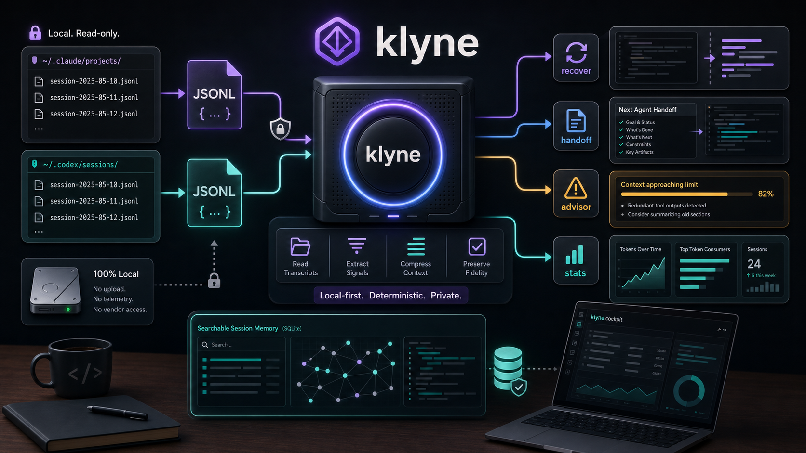
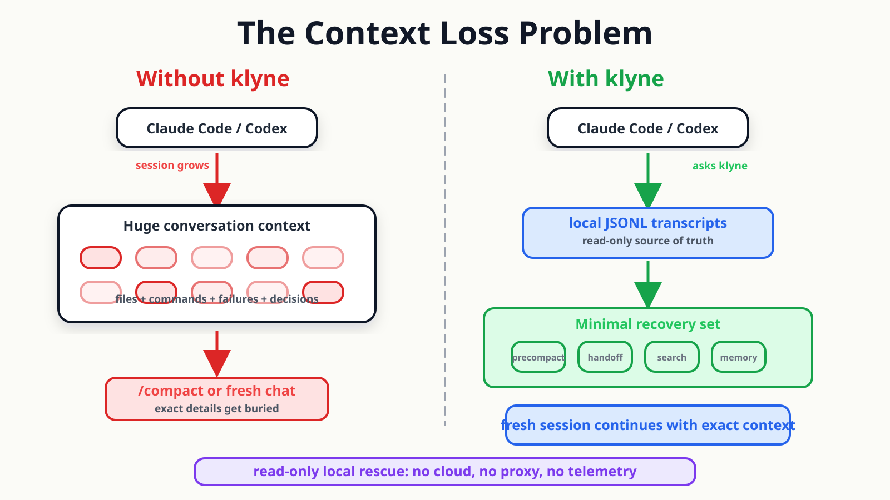
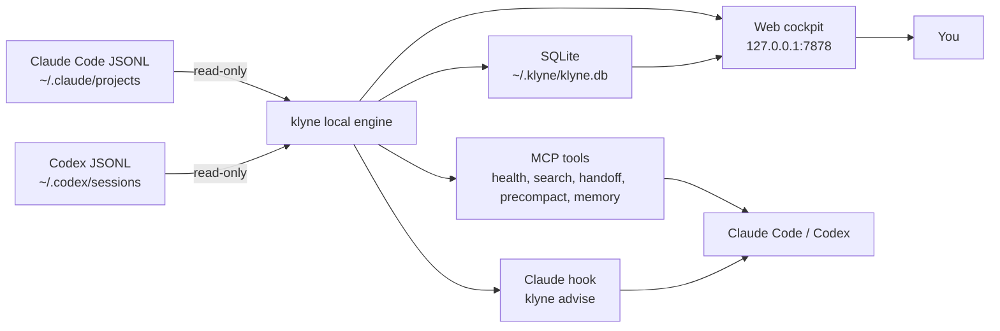
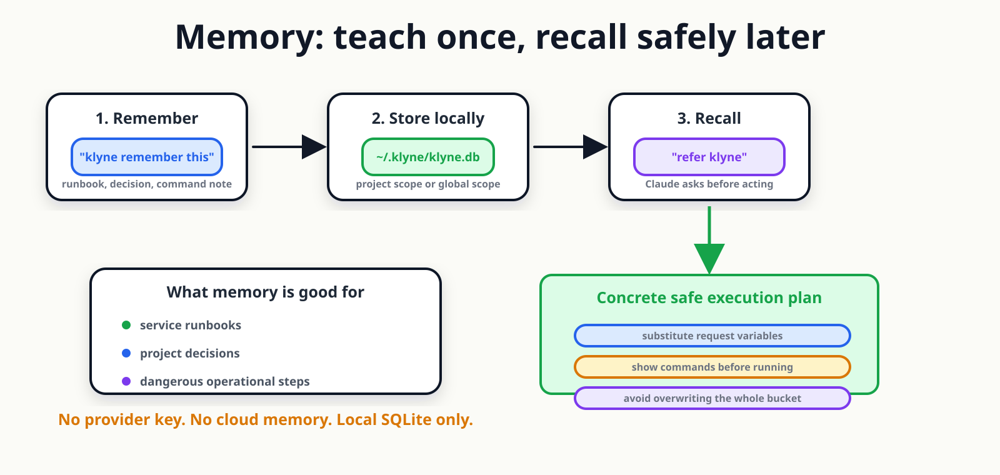

# klyne

> **The source of truth for what your AI coding session has actually done — including the parts the AI itself can no longer see.**

klyne is a **local-first session rescue layer** for Claude Code and Codex CLI. It reads the JSONL files your AI already writes — and gives you back the context that `/compact`, rate limits, and fresh sessions destroy.

**No cloud. No proxy. No telemetry. Read-only by design.**

[](https://youtu.be/2NglEGlq3Ns)

▶ [Watch the 5-minute demo](https://youtu.be/2NglEGlq3Ns) · ⚡ [Install in 60 seconds](#try-it-in-60-seconds) · 📖 [Feature reference](docs/FEATURES.md) · 🔬 [Proofs](docs/proof/)

---

## In 30 seconds

AI coding tools already write the truth to disk: messages, tool calls, file reads, edits, token usage, compact boundaries, and subagent sessions. klyne reads those local JSONL transcripts and turns them into useful recovery tools.



Use it when the AI loses the thread:

| Broken moment | klyne action | Result |
|---|---|---|
| `/compact` buried the exact path, command, or decision | `/klyne:precompact` | Original pre-compact turns from JSONL |
| A task must continue in a fresh Claude/Codex session | `/klyne:handoff` | Touched files, commands, failures, and recent context |
| A session starts burning context or cache badly | `/klyne:health` / `/klyne:tokens` | Context health, token timeline, cache reuse, and plan-window burn |
| A procedure should survive future chats | `klyne remember this ...` | Local project/global memory recalled later with `refer klyne ...` |

Four surfaces, one local engine:

- **MCP server** — Claude Code & Codex CLI can call klyne mid-session.
- **Proactive advisor** — Claude Code hook warns before the next prompt makes the session worse.
- **Web cockpit** — `http://127.0.0.1:7878`. Three-tab shell — **Work** (live sessions, projects, compact), **Memory** (project/global notes), **Insights** (token spend, models, heatmap). `/` opens a global search overlay.
- **Memory** — chat-first project/global notes stored locally and visible at `/memory`.

> **Real maintainer machine, 30 days:** 222 sessions, 84,074 messages, 11.7B input tokens, 97 % cache reuse, $27.0K in priced model compute, and one `oms-service` compact event that shrank 793K tokens to 9K (88x). `klyne audit-sessions` checked stored stats against raw JSONL: **17/17 ✓ (100 %)**.

---

## Real scenarios

Each row maps to a walkthrough with real output in [`docs/FEATURES.md`](docs/FEATURES.md#real-world-walkthroughs).

| Real situation | What klyne found on disk | CTA |
|---|---|---|
| `oms-service` debug session compacted three times | Last boundary: **793,401 tokens -> 9,002** | Run `/klyne:precompact` |
| README/video work had to survive a fresh chat | Handoff found touched files, commands, failures, and recent turns | Run `/klyne:handoff` |
| Agent work hid its true spend | One session spawned **31 subagents** and rolled up **201M input tokens** | Run `klyne subagents --since=168h` |
| Service note must be reused safely | Memory stores project/global notes in `~/.klyne/klyne.db` | Say `klyne remember this ...`, then `refer klyne ...` |
| Session drift starts before you notice | Advisor checks stale files, acceleration, plan-window burn, and hard ceiling | Let the hook warn once per state change |

---

## Try it in 60 seconds

```bash
# 1. Build (Go 1.25+; Makefile sets GOTOOLCHAIN=auto so older Go works too)
git clone https://github.com/klyne-ai/klyne && cd klyne
make build

# 2. Install MCP + advisor + slash commands. Idempotent.
./bin/klyne mcp install

# 3. (Optional) Pick your plan tier so the 5-hour-window advisor has a denominator
./bin/klyne config set plan max-5x   # pro / max-5x / max-20x / team / custom --cap=N

# 4. Start the daemon + open the web UI
./bin/klyne     # opens http://127.0.0.1:7878

# 5. Verify trust against your real transcripts
./bin/klyne audit-sessions --limit 20
```

> ⚠️ **You MUST restart Claude Code (and Codex CLI) after `klyne mcp install`.**
> MCP servers and hook bindings are only loaded at session start. Until you restart, `/klyne:*` slash commands will fail with a "tool not available" error and the advisor / pretool-snapshot / compact-shield / session-end hooks will not fire in your current session. This also applies to every klyne binary upgrade — existing MCP subprocesses keep the old binary in memory.

> **Release status (May 2026):** the Homebrew tap, install script, and binary downloads light up with the first tagged release via [goreleaser](.github/workflows/release.yml). Until v0.1 ships, **build-from-source above is the only path that works today.** The release paths are documented in [§ Install — full reference](#install--full-reference) below.

---

## See klyne work — on real data

Run klyne against *your* Claude / Codex transcripts.

```bash
klyne audit-sessions --limit 20
klyne tokens
klyne files --since=168h
```

A real run on the maintainer's machine on 2026-05-12 (the full picture is in [`docs/FEATURES.md`](docs/FEATURES.md), with every feature shown against live data). These numbers are intentionally concrete; on a live machine they drift upward as new sessions are ingested:

```text
30-day window across both CLIs:
  222 sessions      11.7B input tokens   97% cache reuse
  84,074 messages   46.3M output tokens  $27,036 in priced model compute
  30-day coding streak · favourite model claude-opus-4-7 · peak hour 18:00 IST

Top projects by token usage:
  oms-service       3.11B tokens   13,166 messages
  trackIt           2.66B tokens   23,868 messages
  operations-app    1.24B tokens   11,457 messages
  private-project   980M tokens     5,893 messages

Hot file in trackIt (30d):
  server/src/controllers/transactionController.js — 82 Reads · 54 Edits · 19 sessions

Hidden cost klyne surfaces:
  Session ccf1c911 (private project): 31 subagents · 201M tokens · 96% cached
  None of which the parent session's `cost_usd` ever counted.

/compact events recovered from disk:
  Session 15009012 (oms-service) ran /compact 3 times in 3 days.
  Largest event: 793,401 tokens -> 9,002 tokens — 88x compression.
  Every recoverable token is in JSONL on disk. klyne reads it back.
```

That `88× compression` is exactly the kind of "compacted away" context `get_pre_compact_context` reads back from the JSONL.

---

## Every claim above is a Go test

```bash
make proof
```

Runs every test under [`docs/proof/`](docs/proof/). Each scenario has a fixture you can `cat`, a Go test you can read, and a `claim.md` with the exact side-by-side. **If any claim ever stops holding, the test fails red.** Marketing and code stay locked together — by design.

| Claim | Fixture + test |
|---|---|
| klyne recovers session content Claude can't see after `/compact` | [`docs/proof/01-compact-recovery/`](docs/proof/01-compact-recovery/) |
| klyne's handoff is byte-identical across runs (deterministic) | [`docs/proof/02-handoff-equivalence/`](docs/proof/02-handoff-equivalence/) |
| The proactive advisor fires once per state transition | [`docs/proof/03-advisor/`](docs/proof/03-advisor/) |

---

## Architecture

Four surfaces sharing one local engine:



**The MCP server is independent of the daemon.** Every tool reads JSONL or SQLite directly — they work in fresh sessions before the daemon has had a chance to ingest them.

---

## All features at a glance

> The [complete feature reference](docs/FEATURES.md) groups every surface by the real-world scenario that triggers it, with output samples from real runs.

### MCP tools — auto-invoked by the AI

| Tool | What it solves |
|---|---|
| `bootstrap` | Day-1 session brief: last 3 sessions + last 5 project memories + global preview + latest context-health verdict — synthesized in one call so a fresh session has cross-session context on turn 1 |
| `list_sessions` | Enumerate Claude + Codex sessions in this project |
| `get_context_health` | Classify a session as `healthy` / `drifting` / `risky` / `rescue_now` + bloat scorecard |
| `generate_handoff` | Deterministic Markdown handoff; optional `scope=current-topic` |
| `get_pre_compact_context` | Recover messages from before the last `/compact` |
| `get_token_timeline` | Per-turn token usage — sparkline + table + heatmap, cached vs uncached split |
| `record_decision` / `list_decisions` / `search_decisions` | Project-scoped immutable decisions log |
| `remember` / `recall` | Chat-first memory: project/global notes that survive across fresh sessions |
| `update_memory` / `delete_memory` / `list_memories` | Edit, delete, and browse memories by id — full CRUD parity with derived display names |
| `code_review_context` | Optional `.code-review-graph/` enrichment when present |
| `recap_project` | Cross-AI worklog: visible session-end entries for one project in the last N days, tagged `[claude]` / `[codex]` so the agent answers "what did I do here lately?" across tools |
| `user_recap` | Cross-project, cross-AI rollup: total entries + by-CLI + by-project + top-importance — for "what did I ship this week?" |
| `propose_reflection` | Returns pending worklog entries + a trigger reason (importance-sum / weekly cron / user-invoked) for the agent to synthesize over |
| `record_reflection` | Persists synthesized insights to the reflections table. Citation invariant: every insight must cite at least one source entry — empty-evidence reflections are rejected |

### Slash commands — user-triggered via `/` in Claude Code

| Slash | Calls |
|---|---|
| `/klyne:bootstrap` | `bootstrap` |
| `/klyne:health` | `get_context_health` |
| `/klyne:sessions` | `list_sessions` |
| `/klyne:handoff` | `generate_handoff` |
| `/klyne:precompact` | `get_pre_compact_context` |
| `/klyne:tokens` | `get_token_timeline` |
| `/klyne:reflect` | Cross-AI worklog synthesis: Claude calls `propose_reflection`, synthesizes 3–5 insights with mandatory citations, then calls `record_reflection`. Uses your Claude subscription — no extra API key |

Installed as Markdown slash commands under `~/.claude/commands/klyne/*.md` — each command file calls the matching MCP tool above. Single surface per command, no `(MCP)` duplicates in the slash menu.

### CLI commands — for your terminal

**Setup + daemon**

| Command | Purpose |
|---|---|
| `klyne` (no args) / `klyne start` / `klyne stop` | Daemon lifecycle. Opens `http://127.0.0.1:7878`. |
| `klyne doctor` | JSON diagnostic — paths, providers, schema version, DB size. |
| `klyne mcp install` | Idempotent: registers MCP server in Claude + Codex, installs advisor hook, unpacks slash commands. |
| `klyne config show / get / set <key>` | Two keys: `plan` (advisor cap) and `advisor` (`on` / `off` kill switch). |
| `klyne audit-sessions [--limit N]` | Verify klyne's stored metrics against raw JSONL. The trust foundation. |

**Session insight**

| Command | Purpose |
|---|---|
| `klyne tokens [--session=ID] [--window=Xh]` | Per-turn token timeline + activity heatmap. Full lifetime by default. |
| `klyne files [--mutated-only]` | Per-file heatmap — Reads / Edits / Writes / Sessions per file. |
| `klyne top [--since=24h]` | Tool-call rankings — share, error count, distinct sessions. |
| `klyne patterns [--kind=…]` | Deterministic inefficiency detection: tight loops, Bash overuse, low cache reuse. |
| `klyne roast [--max=N]` | Templated, deterministic zingers. No AI calls. |
| `klyne subagents [--since=24h]` | Roll up Task-tool subagent spend back to the parent session. |
| `klyne decisions add\|list\|search\|delete` | Project-scoped immutable decisions log. |
| `klyne worklog export-week [--project PATH] [--week YYYY-WW]` | Render `<project>/docs/worklog/YYYY-WW.md` from visible worklog entries — conditional on activity, no file written for quiet weeks. Tags each entry with its source CLI. |
| Memory via chat | Say *"klyne remember this …"* / *"refer klyne …"* in Claude Code. Uses MCP `remember` / `recall`; no dedicated CLI alias yet. |
| `klyne statusline [--format=short\|mini\|plain]` | One-line summary for Claude Code's `statusLine` settings hook. |
| `klyne otel emit [--out=PATH] [--since=24h]` | Emit OTel-shaped JSON spans, one per assistant turn. File-only — never pushes off-host. |
| `klyne advise` | Hook entrypoint. You don't run this directly — Claude Code's `UserPromptSubmit` hook does. |

**Inspired by [claudestat](https://github.com/DeibyGS/claudestat) for `top` / `patterns` / `roast`, [tokscale](https://github.com/junhoyeo/tokscale) for the stats dashboard heatmap, [token-dashboard](https://github.com/) for `files`, [mcp-memory-keeper](https://github.com/mkreyman/mcp-memory-keeper) for `decisions`, and [claude-code-otel](https://github.com/ColeMurray/claude-code-otel) for `otel emit`.** All adapted to klyne's contracts: local-first, deterministic, read-only, zero AI calls.

### Web cockpit at `http://127.0.0.1:7878`

The shell is a 3-tab top nav. Search lives behind the `/` overlay, not as a route.

| Tab | Primary view | Deep-link surfaces |
|---|---|---|
| **Work** | `/` — live operational view: running sessions, projects, recent activity. | `/cockpit` (SSE tile grid), `/projects` · `/projects/[name]`, `/sessions/[id]`, `/advisors`. |
| **Memory** | `/memory` — project + global memories grouped by service. Read/filter/delete from the browser; write via chat. | — |
| **Insights** | `/insights` — project-centric, subscription-aware metrics. | `/stats` (Overview / Models / Daily / Stats tabs, activity heatmap, models-by-cost, streaks). |

Press `/` anywhere to open the search overlay (FTS5 across every indexed session).

---

## Why klyne, not just ask Claude?

A fair skeptic question for any rescue layer: if Claude is already in the session, why does klyne need to exist? Every klyne surface falls into one of three modes — three things Claude *cannot* do from its own context:

| Mode | What klyne sees that Claude can't | Example |
|---|---|---|
| **Prevention** | The 5-hour cap window, exact token counts, drift signals, cost acceleration — and a push channel to warn the user *before* compact bites | Advisor hook, `klyne statusline` |
| **Recovery** | The pre-compact JSONL slice (still on disk after Claude's context has dropped it) and the full history of any prior session | `/klyne:precompact`, `/klyne:handoff` after compact, fresh-session restore |
| **Audit / cross-session** | Every Claude + Codex session ever indexed — files, tool calls, subagent spend, token timelines — all queryable from one local store | `klyne files`, `klyne subagents`, `klyne top`, `klyne audit-sessions` |

The two **provably klyne-only** features are `get_pre_compact_context` (the messages are gone from Claude by definition) and the `UserPromptSubmit` advisor (Claude can't intercept its own input, doesn't see the cap window, and only speaks when called). Everything else either sees across sessions or reads `usage` fields Claude doesn't expose.

One concrete example: `klyne subagents` on the maintainer's machine found **134 subagents across 5 parent sessions, 555M tokens** — hidden from the parent session's `cost_usd` because Claude's cost engine only sees the Task tool's final result, not the subagent's full conversation. Claude can't tell you about money you didn't know you were spending.

The honest case where Claude wins: invoked in a short, healthy session, Claude can write a handoff from live context that's often as good or better than klyne's JSONL reconstruction. klyne's edge shows up the moment context is unhealthy, lost, or spread across sessions — which is when handoffs actually matter.

**Full per-command comparison** — what Claude could plausibly try, what klyne does, and why the substitution fails for each MCP tool, slash command, and CLI surface: [`docs/QUESTIONS.md`](docs/QUESTIONS.md).

---

## Memory: project runbooks the AI can actually reuse

Memory is the chat-first version of the decisions log. It uses the same local SQLite table, but the verbs match how you work:

```text
klyne remember this for our auth-service project:
RUNBOOK: add-secret-to-bucket
1. Inspect current keys: ./scripts/openbao/bao-secret.sh get $SVC $BUCKET
2. Patch one key only:  ./scripts/openbao/bao-secret.sh set $SVC $BUCKET $KEY=$VAL
3. Never overwrite the whole bucket.

refer klyne and add NEW_API_KEY=abc123 to auth-service main bucket
```



On recall, klyne returns two labelled lists in one MCP call:

- **Project memories** — stored under the resolved project path.
- **Global memories** — stored with an empty project path and available everywhere.

If a matching memory looks like a runbook, Claude substitutes variables from your request, shows the concrete commands, and asks before running them. The dashboard at `http://127.0.0.1:7878/memory` shows every memory grouped by service, with filters for text and tags.

Details: [`docs/features/memory.md`](docs/features/memory.md).

---

## Cross-AI worklog: what you shipped, across every tool

The worklog is a second persistence layer (separate from the runbook memory above) that captures *what happened* per session — automatically and deterministically — then lets the agent synthesize patterns across them. Two tiers:

**Memory layer — automatic, silent.** Every Claude session that ends writes a worklog entry to `~/.klyne/klyne.db` via the existing `klyne session-end` hook. Entries get an importance score (1–10), an event-tag fingerprint (commit landed, decision recorded, security-relevant file touched, etc.), and a suppression pass that drops trivial sessions. Codex sessions get the same treatment when you opt in:

```toml
# ~/.klyne/config.toml
[worklog]
codex_detector_enabled = true
```

After that, idle Codex sessions (> 30 min since last message) also produce entries, tagged `cli='codex'`. **This is the cross-AI piece** — `/klyne:bootstrap` in a new Claude session now shows both Claude and Codex entries together, so the agent picks up where *either* tool left off.

**Reflection layer — user-invoked, AI-synthesized.** Once you've accumulated enough entries (importance-sum ≥ 150, or end of the week), bootstrap shows a `> **Reflection due**` advisory. Run `/klyne:reflect` and Claude synthesizes 3–5 insights using *your own subscription* — no API key required. Every insight must cite at least one source entry's `session_id`; the citation invariant is enforced at write time so reflections are always grounded in evidence you can audit.

**When to use which:**

| You want… | Surface | Cost |
|---|---|---|
| "What did I do in this project this week?" | `mcp__klyne__recap_project` (auto-invoked by Claude) | Free, SQLite read |
| "What did I ship across all projects this week?" | `mcp__klyne__user_recap` | Free, SQLite read |
| Day-1 brief showing recent Claude + Codex work | `/klyne:bootstrap` | Free, SQLite read |
| Synthesized weekly insights from accumulated entries | `/klyne:reflect` | Your Claude/Codex subscription tokens, ~1 call per week |
| Per-project Markdown digest committed to the repo | `klyne worklog export-week --project /abs/path` | Free, writes `docs/worklog/YYYY-WW.md` only when there's activity |

Both layers are local-first, schema-versioned (migrations 015 + 016), and live in the same SQLite store as everything else klyne tracks.

---

## The proactive advisor in detail

After `klyne mcp install`, every time you press Enter in Claude Code, the hook runs `klyne advise` (< 300 ms p99 on a 50 MB JSONL). If any of four deterministic triggers fires, you see one inline advisory line:

| Trigger | Condition |
|---|---|
| **Stale-context** | > 50 % of loaded file bytes scored Jaccard < 0.20 against your last 5 user messages |
| **Acceleration** | Per-turn uncached input doubled across the last 3 turns vs the previous 5 |
| **5-hour window** | Total uncached input across every Claude + Codex session ≥ 50 % (warn) / 75 % (urgent) of your configured plan cap |
| **Hard ceiling** | Context fill ≥ 75 % |

Each trigger fires **at most once per state transition**. Lifetime cap = 4 advisories per session in the worst case. Zero AI calls in the path. ~80 tokens per advisory, fixed cost, same model as CLAUDE.md.

Silence for a noisy session: `klyne config set advisor off`. Re-enable: `klyne config set advisor on`. The hook stays installed either way; the gate lives in `klyne advise` itself.

---

## Privacy model

klyne is local-first:

- Reads local JSONL transcripts only.
- Stores local SQLite data under `~/.klyne/`.
- Web UI binds to `127.0.0.1` — never `0.0.0.0`.
- Never uploads or proxies conversations.
- Never writes to the source transcript files.

**Optional AI features** in the web cockpit (auto-summary, title generation) require your own provider key and are clearly gated. **Core audit, MCP rescue, search, and handoff features are deterministic and do not require any AI API key.**

Memory is local too: `remember` writes rows into `~/.klyne/klyne.db`; `recall` reads project-scoped and global rows back over MCP. No provider key is involved.

See [`docs/SECURITY.md`](docs/SECURITY.md) for the full threat model.

---

## What klyne does NOT claim

To stay honest:

- klyne does **not** reduce Claude's per-turn token cost. It doesn't intercept the AI loop.
- klyne does **not** save a guaranteed % of your rate-limit budget. The savings depend on whether you would otherwise have re-explained the lost context — varies by user and session.
- klyne does **not** replace `/compact`. Use `/compact` when you need it; klyne lets you survive it without losing recoverable context.
- klyne does **not** call any AI model in the core flow. Every tool here is deterministic over JSONL bytes.
- klyne does **not** predict "you'll exhaust in N turns." Direction-only — claims you can't disprove are noise.

---

## Supported CLIs

| Surface | Claude Code | Codex |
|---|---|---|
| `bootstrap` | ✅ | ✅ |
| `list_sessions` | ✅ | ✅ |
| `get_context_health` | ✅ | ✅ |
| `generate_handoff` | ✅ | ✅ |
| `get_pre_compact_context` | ✅ via `compact_boundary` | ✅ via embedded `replacement_history` |
| `get_token_timeline` | ✅ | ✅ |
| `remember` / `recall` | ✅ | ✅ via MCP |
| `update_memory` / `delete_memory` / `list_memories` | ✅ | ✅ via MCP |
| Trigger-phrase auto-recall (`klyne remember…`, `refer klyne…`) | ✅ via CLAUDE.md rule | ⚠️ explicit MCP calls only until Codex has equivalent project rules |
| `klyne advise` (advisor hook) | ✅ | n/a — Codex CLI doesn't expose `UserPromptSubmit` yet |

For Codex sessions, `pre_tokens` and `trigger` (manual / auto) fields are not exposed in the output — Codex's `compacted` envelope doesn't carry that metadata. The recovered messages themselves are returned identically.

---

## Install — full reference

### Build from source (works today)

```bash
git clone https://github.com/klyne-ai/klyne && cd klyne
make build
# Produces TWO binaries under ./bin/:
#   klyne       — the full CLI + daemon + MCP server (~22 MB)
#   klyne-hook  — lightweight stub (~4 MB) used by Claude Code hooks
```

`go.mod` requires Go **1.25+**. If your local Go is older, the Makefile sets `GOTOOLCHAIN=auto`, so `go` will fetch and cache the right toolchain on first build. To force the system Go, run `GOTOOLCHAIN=local make build` and ensure Go ≥ 1.25.

To install both binaries to `~/.local/bin/` (override with `PREFIX=...`):

```bash
make install
```

### Why two binaries?

Claude Code spawns a hook subprocess on every tool call, every prompt, every `/compact`, and every session end. The full `klyne` binary is ~100 MB resident at launch — on memory-pressured macOS, the kernel's jetsam killer terminates the subprocess at launch and you see silent "Failed with non-blocking status code" hook errors.

`klyne-hook` is a ~4 MB stub that forwards each event to the long-running `klyne` daemon over a Unix socket at `~/.klyne/hook.sock`. The daemon does the actual work using its already-open SQLite connection, then streams the response back. The stub is small enough that jetsam never kills it. When the daemon isn't running (you haven't started `klyne start` yet), `klyne-hook` transparently exec's the full `klyne` binary as a fallback — so behaviour degrades gracefully instead of failing the hook.

`klyne mcp install` automatically wires hooks to `klyne-hook` when it finds the stub adjacent to the main binary; otherwise it falls back to the full `klyne` path so older installs keep working.

### Homebrew — once v0.1 ships

```bash
brew install klyne-ai/tap/klyne
```

Pulls the latest formula from the [klyne-ai/homebrew-tap](https://github.com/klyne-ai/homebrew-tap) tap (created by goreleaser on the first tag push).

### One-line install script — once v0.1 ships

```bash
curl -fsSL https://raw.githubusercontent.com/klyne-ai/klyne/init/scripts/install.sh | sh
```

Detects your OS + arch (darwin/linux × amd64/arm64), pulls the latest release archive from GitHub, verifies sha256 against `checksums.txt`, and installs to `/usr/local/bin/klyne`. Overrides:

- `KLYNE_VERSION=v0.5.0` — pin a specific release.
- `PREFIX=$HOME/.local/bin` — install somewhere else (no sudo).

### Direct download — once v0.1 ships

[github.com/klyne-ai/klyne/releases/latest](https://github.com/klyne-ai/klyne/releases/latest):

- `klyne_<version>_darwin_amd64.tar.gz` / `_darwin_arm64.tar.gz`
- `klyne_<version>_linux_amd64.tar.gz` / `_linux_arm64.tar.gz`
- `klyne_<version>_windows_amd64.zip`

Verify with `checksums.txt`, extract, drop the `klyne` binary on `PATH`.

### After install: wire MCP + advisor

```bash
klyne mcp install
klyne config set plan max-5x   # optional: pro / max-5x / max-20x / team / custom
klyne                          # start daemon + open web UI
```

The `mcp install` command auto-detects host configs and writes every surface idempotently:

| Surface | Config file | Entry written |
|---|---|---|
| Claude Code MCP server | `~/.claude.json` | `mcpServers.klyne` |
| Codex CLI MCP server | `~/.codex/config.toml` | `[mcp_servers.klyne]` |
| Advisor hook | `~/.claude/settings.json` | `hooks.UserPromptSubmit[].klyne` — inline session-drift warnings |
| Pretool snapshot hook | `~/.claude/settings.json` | `hooks.PreToolUse[].klyne` — working-tree snapshot before risky commands |
| Compact-shield hook | `~/.claude/settings.json` | `hooks.PreCompact[].klyne` — intercepts native `/compact` so context is recoverable |
| Session-end hook | `~/.claude/settings.json` | `hooks.Stop[].klyne` — writes deterministic session-end summary to local store |
| Slash commands | `~/.claude/commands/klyne/*.md` | Markdown files for every `/klyne:*` surface |

Pass `--platform claude` or `--platform codex` to scope the install. After it finishes, klyne prints a `RESTART YOUR AI CLI NOW` banner — **heed it.** MCP servers and hook bindings only load at session start, so `/klyne:*` and the hooks won't work in your current session until you relaunch the CLI.

---

## Documentation

| Doc | What's inside |
|---|---|
| 🌟 [**Complete feature reference**](docs/FEATURES.md) | Every feature grouped by real-world scenario, with output samples. The video script reference. |
| 🔬 [Reproducible-proof index](docs/proof/) | Every claim, every fixture, every Go test |
| 📐 [Proactive advisor design](docs/features/proactive-session-advisor.md) | v1 spec for the `UserPromptSubmit` hook |
| 📊 [Analytics commands design](docs/features/analytics-commands.md) | `top` / `patterns` / `roast` design |
| 📊 [v2 surfaces design](docs/features/v2-statusline-files-decisions-subagents-otel.md) | `statusline` / `files` / `decisions` / `subagents` / `otel` |
| 📊 [v3 stats dashboard design](docs/features/v3-stats-dashboard.md) | `/stats` web page + heatmap CLI |
| 🧠 [Memory feature](docs/features/memory.md) | `remember` / `recall`, project vs global scope, `/memory` dashboard, CLAUDE.md rule |
| 🧪 [CLI review (2026-05-10)](docs/cli-review-2026-05-10.md) | Every CLI command tested live against real Claude + Codex sessions |
| 🚚 [MCP ship log](docs/MCP-SHIP-LOG.md) | Every slice that landed, in order |
| 🛡️ [Security model](docs/SECURITY.md) | Threat model + privacy contract |
| 🧭 [Context-rescue strategy](docs/marketing/context-rescue-strategy.md) | Why klyne exists, framed against neighbours |
| 🆚 [Comparison and gaps](docs/marketing/comparison-and-gaps.md) | klyne vs ccusage / ccsession / mcp-memory-keeper / claudestat / claude-code-otel |
| ❓ [Positioning questions](docs/QUESTIONS.md) | Per-command Claude-vs-klyne comparison — why each surface exists when Claude is already in the loop |

---

## License

MIT. See [LICENSE](LICENSE).
