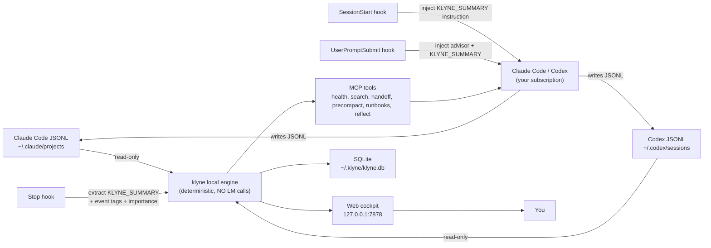

# klyne

> **The source of truth for what your AI coding session has actually done — including the parts the AI itself can no longer see.**

klyne is a **local-first session rescue layer** for Claude Code and Codex CLI. It reads the JSONL files your AI already writes — and gives you back the context that `/compact`, rate limits, and fresh sessions destroy.

**No cloud. No proxy. No telemetry. No API key. No subprocesses.** The daemon never spawns an LM call. Every word of synthesis happens inside *your* interactive Claude / Codex session, on your existing subscription.

▶ [Install in 60 seconds](#try-it-in-60-seconds) · 📖 [Feature reference](docs/FEATURES.md) · 🔬 [Proofs](docs/proof/)

---

## In 30 seconds

AI coding tools already write the truth to disk: messages, tool calls, file reads, edits, token usage, compact boundaries, subagent sessions. klyne reads those local JSONL transcripts and turns them into useful recovery tools.


Use it when the AI loses the thread:

| What you want to know | klyne action | Result |
|---|---|---|
| "What did I ship this week across Claude AND Codex?" | `/klyne:reflect` | Loads each session's deterministic event tags + the assistant's own per-turn `KLYNE_SUMMARY` lines; your interactive session synthesises 3–5 dated insights with citations back to source sessions. Zero out-of-session tokens. |
| Active session is burning context or cache badly | `/klyne:status` | Health verdict + recommended action + token timeline + bloat sources in one Markdown payload |
| Starting fresh and need yesterday's context | `/klyne:bootstrap` | Day-1 brief: recent sessions, runbooks (project + global), reflections, and cross-AI worklog entries — assembled by deterministic SQLite reads |
| `/compact` buried the exact path, command, or decision | `/klyne:precompact` | Original pre-compact turns from JSONL |

Four surfaces, one local engine:

- **Hooks** — `SessionStart` injects a per-turn summary instruction; `UserPromptSubmit` re-injects it + the advisor line; `Stop` extracts the assistant's `KLYNE_SUMMARY` reply and writes it to a local SQLite row. All deterministic, all in-process.
- **MCP server** — Claude Code & Codex CLI can call klyne mid-session for status, sessions, handoff, precompact, runbooks, reflect.
- **Web cockpit** — `http://127.0.0.1:7878`. Four-tab shell: **Work** (live sessions, projects, compact), **Runbooks** (project/global ops-annotations consulted before risky shell commands), **Worklog** (per-session entries), **Insights** (token spend, models, heatmap). `/` opens a global search overlay.
- **CLI** — `klyne audit-sessions`, `klyne files`, `klyne tokens`, `klyne top`, `klyne patterns`, `klyne subagents`, `klyne decisions`, `klyne otel emit`. All read-only over local JSONL + SQLite.

---

## How klyne captures what you did (the daemon-free flow)

The big architectural decision: **klyne never makes an LM call from the daemon.** Yesterday's interactive turn is also today's summary writer. Here's the full per-turn loop:

```
[you press Enter in Claude Code]
   │
   ▼
1. UserPromptSubmit hook fires
   • klyne-hook → daemon socket → Advise()
   • Returns: hookSpecificOutput.additionalContext = advisor line (if any) +
     KLYNE_SUMMARY instruction telling the model to emit one summary line
     at the end of its reply. ~80 tokens, deterministic.
   │
   ▼
2. Claude / Codex generates its reply
   • On YOUR subscription, as always. The injected instruction makes
     the model end with `KLYNE_SUMMARY: <text>` or `KLYNE_SUMMARY: skip`.
   │
   ▼
3. Stop hook fires (per turn, not per session)
   • klyne-hook → daemon socket → SessionEnd()
   • Polls the JSONL until the final assistant text is flushed,
     then deterministically extracts:
       - last_user / last_bash / files_touched
       - event tags (commit_landed, pr_opened, decision_recorded, …)
       - importance score (1–10) from those tags
       - ai_drafted_summary ← the captured KLYNE_SUMMARY line
   • Writes one stop_summaries row. NO LM CALL.
```

When you later run `/klyne:reflect`, the MCP tool returns the raw stop_summaries rows. Your interactive session synthesises the insights. Same chat, same subscription, zero subprocesses.

> **`SessionStart` is the load-bearing hook for `claude --print` mode** (one-shot, CI, scripted). That mode skips `UserPromptSubmit`, so without `SessionStart` the instruction never reaches the model. klyne wires both for full coverage of interactive AND scripted flows.

---

## Try it in 60 seconds

```bash
# 1. Build (Go 1.25+; the Makefile sets GOTOOLCHAIN=auto so older Go works too)
git clone https://github.com/klyne-ai/klyne && cd klyne
make build

# 2. Wire hooks + MCP into Claude Code (and Codex if you have it). Idempotent.
./bin/klyne mcp install

# 3. (Optional) Pick your plan tier so the 5-hour-window advisor has a denominator
./bin/klyne config set plan max-5x   # pro / max-5x / max-20x / team / custom --cap=N

# 4. Start the daemon + open the web UI
./bin/klyne     # opens http://127.0.0.1:7878

# 5. Verify trust against your real transcripts
./bin/klyne audit-sessions --limit 20
```

> ⚠️ **You MUST restart Claude Code (and Codex CLI) after `klyne mcp install`.**
> MCP servers and hook bindings are only loaded at session start. Until you restart, `/klyne:*` slash commands will fail with a "tool not available" error and the advisor / pretool / compact-shield / session-start / session-end hooks will not fire in your current session.

> **Release status (May 2026):** the Homebrew tap, install script, and binary downloads light up with the first tagged release via [goreleaser](.github/workflows/release.yml). Until v0.1 ships, **build-from-source above is the only path that works today.** The release paths are documented in [§ Install — full reference](#install--full-reference) below.

---

## See klyne work — on real data

Run klyne against *your* Claude / Codex transcripts.

```bash
klyne audit-sessions --limit 20
klyne tokens
klyne files --since=168h
```

A real run on the maintainer's machine on 2026-05-12 (the full picture is in [`docs/FEATURES.md`](docs/FEATURES.md)). These numbers are intentionally concrete; on a live machine they drift upward as new sessions are ingested:

```text
30-day window across both CLIs:
  222 sessions      11.7B input tokens   97% cache reuse
  84,074 messages   46.3M output tokens  $27,036 in priced model compute
  30-day coding streak · favourite model claude-opus-4-7 · peak hour 18:00 IST

Top projects by token usage:
  oms-service       3.11B tokens   13,166 messages
  trackIt           2.66B tokens   23,868 messages
  operations-app    1.24B tokens   11,457 messages
  private-project   980M tokens     5,893 messages

Hot file in trackIt (30d):
  server/src/controllers/transactionController.js — 82 Reads · 54 Edits · 19 sessions

Hidden cost klyne surfaces:
  Session ccf1c911 (private project): 31 subagents · 201M tokens · 96% cached
  None of which the parent session's `cost_usd` ever counted.

/compact events recovered from disk:
  Session 15009012 (oms-service) ran /compact 3 times in 3 days.
  Largest event: 793,401 tokens -> 9,002 tokens — 88x compression.
  Every recoverable token is in JSONL on disk. klyne reads it back.
```

That `88× compression` is exactly the kind of "compacted away" context `get_pre_compact_context` reads back from the JSONL.

---

## Every claim above is a Go test

```bash
make proof
```

Runs every test under [`docs/proof/`](docs/proof/). Each scenario has a fixture you can `cat`, a Go test you can read, and a `claim.md` with the exact side-by-side. **If any claim ever stops holding, the test fails red.**

| Claim | Fixture + test |
|---|---|
| klyne recovers session content Claude can't see after `/compact` | [`docs/proof/01-compact-recovery/`](docs/proof/01-compact-recovery/) |
| klyne's handoff is byte-identical across runs (deterministic) | [`docs/proof/02-handoff-equivalence/`](docs/proof/02-handoff-equivalence/) |
| The proactive advisor fires once per state transition | [`docs/proof/03-advisor/`](docs/proof/03-advisor/) |

End-to-end harness for the per-turn capture loop:

```bash
node test/e2e/harness.mjs feature    # commit-driven session → ai_drafted_summary populated, importance ≥ 7
node test/e2e/harness.mjs bug        # prose-only finding → row exists, summary may be populated or "skip"
node test/e2e/harness.mjs decision   # decision recorded → row exists
node test/e2e/harness.mjs trivial    # "say hi" → row suppressed (recap_visible=0), summary empty
```

Each scenario asserts that **zero `claude --print` subprocesses were spawned by the daemon** — the test would have caught the recursive feedback loop we removed in May 2026.

---

## Architecture

Four surfaces sharing one local engine:



**The daemon never calls a model.** It only reads JSONL, writes SQLite, serves the UI, and forwards hook events through a Unix socket. Every word of prose synthesis happens in your interactive AI session, on your existing subscription.

---

## All features at a glance

> The [complete feature reference](docs/FEATURES.md) groups every surface by the real-world scenario that triggers it, with output samples from real runs.

### MCP tools — auto-invoked by the AI

| Tool | What it solves |
|---|---|
| `bootstrap` | Day-1 session brief: last 3 sessions + top 5 project runbooks + global preview + recent reflections + cross-AI worklog entries — assembled by deterministic SQLite reads so a fresh session has cross-session context on turn 1. |
| `list_sessions` | Enumerate Claude + Codex sessions in this project |
| `get_context_health` | Classify a session as `healthy` / `drifting` / `risky` / `rescue_now` + bloat scorecard |
| `generate_handoff` | Deterministic Markdown handoff; optional `scope=current-topic` |
| `get_pre_compact_context` | Recover messages from before the last `/compact` |
| `get_token_timeline` | Per-turn token usage — sparkline + table + heatmap, cached vs uncached split |
| `record_decision` / `list_decisions` / `search_decisions` | Project-scoped immutable decisions log |
| `remember` / `recall` | Chat-first runbooks: project/global ops-annotations that survive across fresh sessions; `recall` fires automatically before risky shell commands per the CLAUDE.md rule |
| `update_memory` / `delete_memory` / `list_memories` | Edit, delete, and browse runbooks by id — full CRUD parity |
| `code_review_context` | Optional `.code-review-graph/` enrichment when present |
| `recap_project` | Cross-AI worklog: visible session-end entries for one project, tagged `[claude]` / `[codex]` |
| `user_recap` | Cross-project, cross-AI rollup: total entries + by-CLI + by-project + top-importance |
| `propose_reflection` | Returns pending worklog entries (`ai_drafted_summary` + event tags + importance) for *your* session to synthesise over |
| `record_reflection` | Persists synthesised insights authored by your session. Citation invariant: every insight must cite at least one source entry's `session_id` — empty-evidence reflections are rejected |

### Slash commands — user-triggered via `/` in Claude Code

| Slash | Calls |
|---|---|
| `/klyne:bootstrap` | `bootstrap` |
| `/klyne:status` | `get_session_status` — verdict + recommended action + token timeline + bloat sources in one Markdown payload |
| `/klyne:sessions` | `list_sessions` |
| `/klyne:handoff` | `generate_handoff` |
| `/klyne:precompact` | `get_pre_compact_context` |
| `/klyne:reflect` | Surfaces pending worklog rows; *your interactive session* synthesises 3–5 insights with citations and records them. No daemon-side LM call. |

Installed as Markdown slash commands under `~/.claude/commands/klyne/*.md`.

### CLI commands — for your terminal

**Setup + daemon**

| Command | Purpose |
|---|---|
| `klyne` (no args) / `klyne start` / `klyne stop` | Daemon lifecycle. Opens `http://127.0.0.1:7878`. |
| `klyne doctor` | JSON diagnostic — paths, schema version, DB size, connector roots. |
| `klyne mcp install` | Idempotent: registers MCP server, installs all five hooks (session-start, advisor, pretool, compact-shield, session-end), unpacks slash commands. |
| `klyne config show / get / set <key>` | Two keys: `plan` (advisor cap) and `advisor` (`on` / `off` kill switch). |
| `klyne audit-sessions [--limit N]` | Verify klyne's stored metrics against raw JSONL. The trust foundation. |

**Session insight**

| Command | Purpose |
|---|---|
| `klyne tokens [--session=ID] [--window=Xh]` | Per-turn token timeline + activity heatmap. Full lifetime by default. |
| `klyne files [--mutated-only]` | Per-file heatmap — Reads / Edits / Writes / Sessions per file. |
| `klyne top [--since=24h]` | Tool-call rankings — share, error count, distinct sessions. |
| `klyne patterns [--kind=…]` | Deterministic inefficiency detection: tight loops, Bash overuse, low cache reuse. |
| `klyne roast [--max=N]` | Templated, deterministic zingers. No AI calls. |
| `klyne subagents [--since=24h]` | Roll up Task-tool subagent spend back to the parent session. |
| `klyne decisions add\|list\|search\|delete` | Project-scoped immutable decisions log. |
| `klyne worklog export-week [--project PATH] [--week YYYY-WW]` | Render `<project>/docs/worklog/YYYY-WW.md` from visible worklog entries; conditional on activity. |
| Runbooks via chat | Say *"klyne remember this …"* / *"refer klyne …"* in Claude Code. Uses MCP `remember` / `recall`. |
| `klyne statusline [--format=short\|mini\|plain]` | One-line summary for Claude Code's `statusLine` settings hook. |
| `klyne otel emit [--out=PATH] [--since=24h]` | Emit OTel-shaped JSON spans, one per assistant turn. File-only — never pushes off-host. |
| `klyne advise` | Hook entrypoint. You don't run this directly — Claude Code's `UserPromptSubmit` hook does. |

### Web cockpit at `http://127.0.0.1:7878`

The shell is a 4-tab top nav. Search lives behind the `/` overlay, not as a route.

| Tab | Primary view | Deep-link surfaces |
|---|---|---|
| **Work** | `/` — live operational view: running sessions, projects, recent activity. | `/cockpit` (SSE tile grid), `/projects` · `/projects/[name]`, `/sessions/[id]`, `/advisors`. |
| **Runbooks** | `/runbooks` — project + global runbooks grouped by service. The pre-execution-recall surface. | — |
| **Worklog** | `/worklog` — per-session entries (auto-captured via Stop hook). | — |
| **Insights** | `/insights` — project-centric productivity rollup; **What was done** is deterministic, filtered to importance ≥ 7 (commit-driven / decision / migration / security / error-resolution / revert) so trivial sessions don't dilute the list. | `/stats` (Overview / Models / Daily / Stats, heatmap, models-by-cost, streaks). |

Press `/` anywhere to open the search overlay (FTS5 across every indexed session).

---

## Why klyne, not just ask Claude?

A fair skeptic question: if Claude is already in the session, why does klyne need to exist? Every klyne surface falls into one of three modes — three things Claude *cannot* do from its own context:

| Mode | What klyne sees that Claude can't | Example |
|---|---|---|
| **Prevention** | The 5-hour cap window, exact token counts, drift signals, cost acceleration — and a push channel to warn the user *before* compact bites | Advisor hook, `klyne statusline` |
| **Recovery** | The pre-compact JSONL slice (still on disk after Claude's context has dropped it) and the full history of any prior session | `/klyne:precompact`, `/klyne:handoff` after compact, fresh-session restore |
| **Audit / cross-session** | Every Claude + Codex session ever indexed — files, tool calls, subagent spend, token timelines — all queryable from one local store | `klyne files`, `klyne subagents`, `klyne top`, `klyne audit-sessions` |

The two **provably klyne-only** features are `get_pre_compact_context` (the messages are gone from Claude by definition) and the proactive advisor (Claude can't intercept its own input, doesn't see the cap window, and only speaks when called). Everything else either sees across sessions or reads `usage` fields Claude doesn't expose.

**Full per-command comparison** — [`docs/QUESTIONS.md`](docs/QUESTIONS.md).

---

## Runbooks: pre-execution recall the AI can actually use

Runbooks are the chat-first project ops-annotations klyne consults **before** Claude runs operational shell commands. Same local SQLite store as the decisions log, with verbs that match how you work:

```text
klyne remember this for our auth-service project:
RUNBOOK: add-secret-to-bucket
1. Inspect current keys: ./scripts/openbao/bao-secret.sh get $SVC $BUCKET
2. Patch one key only:  ./scripts/openbao/bao-secret.sh set $SVC $BUCKET $KEY=$VAL
3. Never overwrite the whole bucket.

refer klyne and add NEW_API_KEY=abc123 to auth-service main bucket
```


On recall, klyne returns two labelled lists in one MCP call:

- **Project runbooks** — stored under the resolved project path.
- **Global runbooks** — stored with an empty project path; available everywhere.

If a matching runbook is found, Claude substitutes variables from your request, shows the concrete commands, and asks before running them. The dashboard at `http://127.0.0.1:7878/runbooks` shows every runbook grouped by service.

Details: [`docs/features/runbooks.md`](docs/features/runbooks.md).

---

## Cross-AI worklog: what you shipped, across every tool

The worklog is the persistence layer for "what happened" per session. Two tiers, both fully local:

**Memory layer — automatic, silent, deterministic.** Every Claude session that ends writes a worklog entry to `~/.klyne/klyne.db` via the Stop hook. Entries get:

- An **importance score (1–10)** derived from event tags (commit_landed +2, pr_opened +3, decision_recorded +3, migration_or_schema_change +2, security_relevant_change +2, error_resolved +1, …).
- An **event-tag fingerprint** for deterministic filtering.
- An **`ai_drafted_summary`** — the per-turn prose the assistant emitted via `KLYNE_SUMMARY` in its reply. Empty when the model said `skip` (trivial turn). Not a daemon-side LM call: the model writes one line at the end of its normal reply, on your subscription.
- Suppression for trivial sessions via deterministic rules (`ShouldSuppress` — too-short, read-only, no-signal).

Codex sessions get the same treatment when you opt in:

```toml
# ~/.klyne/config.toml
[worklog]
codex_detector_enabled = true
```

**Reflection layer — user-invoked, AI-synthesised, in YOUR session.** Once you've accumulated enough entries (importance-sum ≥ 150, or end of the week), bootstrap shows a `> **Reflection due**` advisory. Run `/klyne:reflect` and *your interactive Claude / Codex session* synthesises 3–5 insights using its already-open context. The MCP tool only returns raw rows — synthesis is your session's job, billed to your subscription as a normal turn. Every insight must cite at least one source entry's `session_id`; the citation invariant is enforced at write time.

**When to use which:**

| You want… | Surface | Cost |
|---|---|---|
| "What did I do in this project this week?" | `mcp__klyne__recap_project` | Free, SQLite read |
| "What did I ship across all projects this week?" | `mcp__klyne__user_recap` | Free, SQLite read |
| Day-1 brief showing recent Claude + Codex work | `/klyne:bootstrap` | Free, SQLite read |
| Synthesised weekly insights from accumulated entries | `/klyne:reflect` | One turn of your interactive subscription, ~1 call per week |
| Per-project Markdown digest committed to the repo | `klyne worklog export-week --project /abs/path` | Free, writes `docs/worklog/YYYY-WW.md` only when there's activity |

Both layers are local-first, schema-versioned (migrations 015 + 016), and live in the same SQLite store as everything else klyne tracks.

---

## The proactive advisor in detail

After `klyne mcp install`, every time you press Enter in Claude Code, the hook runs `klyne advise` (< 300 ms p99 on a 50 MB JSONL). If any of four deterministic triggers fires, you see one inline advisory line:

| Trigger | Condition |
|---|---|
| **Stale-context** | > 50 % of loaded file bytes scored Jaccard < 0.20 against your last 5 user messages |
| **Acceleration** | Per-turn uncached input doubled across the last 3 turns vs the previous 5 |
| **5-hour window** | Total uncached input across every Claude + Codex session ≥ 50 % (warn) / 75 % (urgent) of your configured plan cap |
| **Hard ceiling** | Context fill ≥ 75 % |

Each trigger fires **at most once per state transition**. Lifetime cap = 4 advisories per session in the worst case. Zero LM calls in the path. ~80 tokens per advisory, fixed cost.

Silence for a noisy session: `klyne config set advisor off`. Re-enable: `klyne config set advisor on`. The hook stays installed either way; the gate lives in `klyne advise` itself.

---

## Privacy model

klyne is local-first and LM-free on the daemon side:

- Reads local JSONL transcripts only.
- Stores local SQLite data under `~/.klyne/`.
- Web UI binds to `127.0.0.1` — never `0.0.0.0`.
- Never uploads or proxies conversations.
- Never writes to the source transcript files.
- **Never spawns an LM subprocess.** The daemon issues zero `claude --print` / `codex` / `ollama` calls. Synthesis (titles, summaries, reflections) happens inline in your interactive Claude / Codex turn via the SessionStart + UserPromptSubmit hooks.

That last point matters because the previous architecture used a daemon-side AI runner that shelled out to `claude --print` — and a 30-day backfill on each restart could spike subscription spend. The current architecture cannot do that: there are no provider constructors, no `summary_model` / `title_model` / `embed_model` config knobs, no rich-entry worker. The `[ai]` table is gone from the schema.

See [`docs/SECURITY.md`](docs/SECURITY.md) for the full threat model.

---

## What klyne does NOT claim

To stay honest:

- klyne does **not** reduce Claude's per-turn token cost. It doesn't intercept the AI loop.
- klyne does **not** save a guaranteed % of your rate-limit budget. The savings depend on whether you would otherwise have re-explained the lost context — varies by user and session.
- klyne does **not** replace `/compact`. Use `/compact` when you need it; klyne lets you survive it without losing recoverable context.
- klyne does **not** call any AI model from the daemon. The `KLYNE_SUMMARY` line at the end of each reply costs ~80 input + ~50 output tokens of your normal interactive turn — that's the entire incremental cost.
- klyne does **not** predict "you'll exhaust in N turns." Direction-only — claims you can't disprove are noise.

---

## Supported CLIs

| Surface | Claude Code | Codex |
|---|---|---|
| `bootstrap` | ✅ | ✅ |
| `list_sessions` | ✅ | ✅ |
| `get_context_health` | ✅ | ✅ |
| `generate_handoff` | ✅ | ✅ |
| `get_pre_compact_context` | ✅ via `compact_boundary` | ✅ via embedded `replacement_history` |
| `get_token_timeline` | ✅ | ✅ |
| `remember` / `recall` | ✅ | ✅ via MCP |
| `update_memory` / `delete_memory` / `list_memories` | ✅ | ✅ via MCP |
| KLYNE_SUMMARY per-turn capture (SessionStart + Stop) | ✅ | ⚠️ Stop hook only — Codex doesn't expose SessionStart yet; UserPromptSubmit equivalent works once Codex adds it |
| `klyne advise` (advisor hook) | ✅ | n/a — Codex CLI doesn't expose `UserPromptSubmit` yet |

For Codex sessions, `pre_tokens` and `trigger` (manual / auto) fields are not exposed in the output — Codex's `compacted` envelope doesn't carry that metadata.

---

## Install — full reference

### Build from source (works today)

```bash
git clone https://github.com/klyne-ai/klyne && cd klyne
make build
# Produces TWO binaries under ./bin/:
#   klyne       — the full CLI + daemon + MCP server (~22 MB)
#   klyne-hook  — lightweight stub (~4 MB) used by Claude Code hooks
```

`go.mod` requires Go **1.25+**. The Makefile sets `GOTOOLCHAIN=auto`, so `go` will fetch and cache the right toolchain on first build. To force the system Go, run `GOTOOLCHAIN=local make build` and ensure Go ≥ 1.25.

To install both binaries to `~/.local/bin/` (override with `PREFIX=...`):

```bash
make install
```

### Why two binaries?

Claude Code spawns a hook subprocess on every tool call, every prompt, every `/compact`, every session end, and every session start. The full `klyne` binary is ~100 MB resident at launch — on memory-pressured macOS, the kernel's jetsam killer terminates the subprocess at launch and you see silent "Failed with non-blocking status code" hook errors.

`klyne-hook` is a ~4 MB stub that forwards each event to the long-running `klyne` daemon over a Unix socket at `~/.klyne/hook.sock`. The daemon does the actual work using its already-open SQLite connection, then streams the response back. The stub is small enough that jetsam never kills it. When the daemon isn't running, `klyne-hook` transparently exec's the full `klyne` binary as a fallback — behaviour degrades gracefully instead of failing the hook.

### Homebrew / one-line install / direct download — once v0.1 ships

```bash
brew install klyne-ai/tap/klyne
# or
curl -fsSL https://raw.githubusercontent.com/klyne-ai/klyne/init/scripts/install.sh | sh
# or download the platform archive from
# https://github.com/klyne-ai/klyne/releases/latest
```

### After install: wire MCP + hooks

```bash
klyne mcp install
klyne config set plan max-5x   # optional: pro / max-5x / max-20x / team / custom
klyne                          # start daemon + open web UI
```

The `mcp install` command auto-detects host configs and writes every surface idempotently:

| Surface | Config file | Entry written |
|---|---|---|
| Claude Code MCP server | `~/.claude.json` | `mcpServers.klyne` |
| Codex CLI MCP server | `~/.codex/config.toml` | `[mcp_servers.klyne]` |
| **SessionStart hook** (per-turn KLYNE_SUMMARY for `claude --print` mode) | `~/.claude/settings.json` | `hooks.SessionStart[].klyne` |
| Advisor hook (UserPromptSubmit) | `~/.claude/settings.json` | `hooks.UserPromptSubmit[].klyne` — inline drift warnings + KLYNE_SUMMARY instruction |
| Pretool snapshot hook (PreToolUse) | `~/.claude/settings.json` | `hooks.PreToolUse[].klyne` — working-tree snapshot before risky commands |
| Compact-shield hook (PreCompact) | `~/.claude/settings.json` | `hooks.PreCompact[].klyne` — intercepts native `/compact` so context is recoverable |
| Session-end hook (Stop) | `~/.claude/settings.json` | `hooks.Stop[].klyne` — extracts KLYNE_SUMMARY + writes deterministic session-end summary |
| Slash commands | `~/.claude/commands/klyne/*.md` | Markdown files for every `/klyne:*` surface |

Pass `--platform claude` or `--platform codex` to scope the install. After it finishes, klyne prints a `RESTART YOUR AI CLI NOW` banner — **heed it.** MCP servers and hook bindings only load at session start.

---

## Documentation

| Doc | What's inside |
|---|---|
| 🌟 [**Complete feature reference**](docs/FEATURES.md) | Every feature grouped by real-world scenario, with output samples. |
| 🔬 [Reproducible-proof index](docs/proof/) | Every claim, every fixture, every Go test |
| 📐 [Proactive advisor design](docs/features/proactive-session-advisor.md) | v1 spec for the `UserPromptSubmit` hook |
| 📊 [Analytics commands design](docs/features/analytics-commands.md) | `top` / `patterns` / `roast` design |
| 📊 [Stats dashboard](docs/features/stats-dashboard.md) | `/stats` web page + heatmap CLI |
| 📊 [Statusline](docs/features/statusline.md) | Single-line render for Claude Code's `statusLine` hook |
| 📊 [File heatmap](docs/features/file-heatmap.md) | `klyne files` per-file Read/Edit/Write rollup |
| 📊 [Subagent attribution](docs/features/subagent-attribution.md) | `klyne subagents` surfaces Task-tool spend hidden from parent cost |
| 📊 [OTel exporter](docs/features/otel-exporter.md) | `klyne otel emit` OTel-shaped JSONL exporter |
| 🧠 [Runbooks feature](docs/features/runbooks.md) | `remember` / `recall`, project vs global scope, `/runbooks` dashboard |
| 🚚 [MCP ship log](docs/MCP-SHIP-LOG.md) | Every slice that landed, in order |
| 🛡️ [Security model](docs/SECURITY.md) | Threat model + privacy contract |
| 🧭 [Context-rescue strategy](docs/marketing/context-rescue-strategy.md) | Why klyne exists, framed against neighbours |
| 🆚 [Comparison and gaps](docs/marketing/comparison-and-gaps.md) | klyne vs ccusage / ccsession / mcp-memory-keeper / claudestat / claude-code-otel |
| ❓ [Positioning questions](docs/QUESTIONS.md) | Per-command Claude-vs-klyne comparison |

---

## License

MIT. See [LICENSE](LICENSE).
