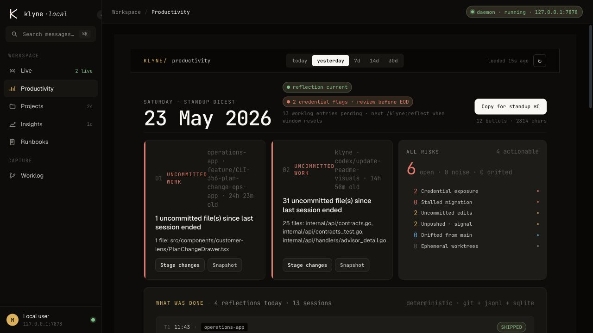
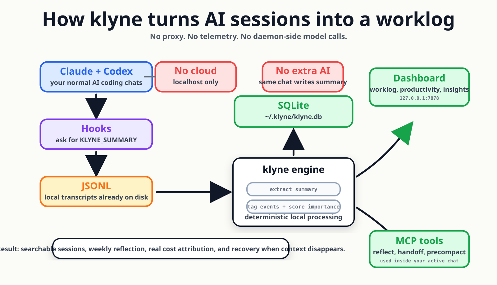
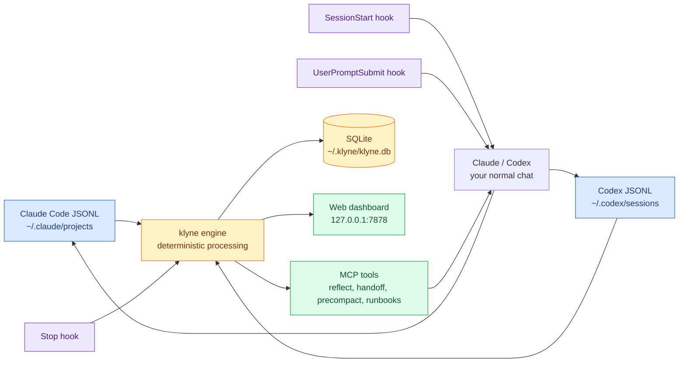

# klyne

**The local productivity layer for engineers who code with AI.**

Claude Code and Codex CLI already write the raw record of your work. klyne turns those local transcripts into a worklog, productivity dashboard, weekly reflection, runbooks, and context-rescue tools without proxying your chats or running a second model.

[Install](#install-in-60-seconds) | [Dashboard](#dashboard) | [How it works](#how-it-works) | [Privacy](#privacy-model) | [Contributing](#contributing)



## What you get

| Surface | What it answers |
|---|---|
| **Productivity** | What did I actually ship today, what is risky, and what can I copy into standup? |
| **Worklog** | Which Claude and Codex sessions mattered, with AI-written summaries and importance scores? |
| **Insights** | Which projects, models, tools, and hidden subagents burned the time and tokens? |
| **Runbooks** | What should the AI remember before it runs operational commands in this project? |
| **Rescue tools** | What did `/compact` hide, and what should the next fresh session know? |

## Why klyne exists

AI coding made parallel work normal: multiple agents, multiple repos, long sessions, frequent compaction, and lots of decisions that never make it into a ticket. By Friday, the raw transcripts exist on disk, but the useful story is buried.

klyne gives you that story locally:

- **One timeline for Claude + Codex** instead of separate terminal histories.
- **AI-written summaries** captured inline from the same assistant reply you were already getting.
- **Deterministic scoring** for commits, PRs, decisions, migrations, security work, fixes, and low-signal sessions.
- **Cost and activity rollups** from local JSONL plus SQLite.
- **Context recovery** when a compacted or fresh chat can no longer see the original turn.



## Dashboard

klyne runs at `http://127.0.0.1:7878` and stays local to your machine.

| Tab | Snapshot |
|---|---|
| **Productivity** | Standup digest, uncommitted work, risk flags, and "what was done" bullets. URL: `/productivity`. |
| **Worklog** | Important sessions from Claude and Codex, interleaved by time. |
| **Insights** | Token economics, model mix, project ranking, activity rhythm, and cache behavior. |
| **Runbooks** | Project/global memories the AI can recall before risky commands. |

### Productivity dashboard — what's deterministic

The productivity tab offers four ranges: **Today**, **Yesterday**, **This Week** (Mon→now, ISO week), **Last Week** (Mon→Sun prior). Past days are snapshot-backed so reloads show the same numbers; today is recomputed live since the day isn't done yet.

- Daily snapshots are written either by `/klyne:reflect` (authoritative — your blessed summary) or by the dashboard handler on first read of a past day (lazy backfill). Reflection snapshots beat live snapshots; running `/klyne:reflect` again refreshes the day.
- Merged-PR data comes from `gh pr list` and is TTL-cached; you don't need `gh` installed, but the PR column will be empty without it.
- Hit the **Refresh** button (or `?refresh=1`) to force a recompute that bypasses both snapshots and the PR cache.
- All productivity numbers are computed locally from your sessions/messages and `git log` — **no LLM is called** in the dashboard's data path. LLM use is quarantined to `/klyne:reflect`, which only runs when you invoke it.

<details>
<summary>What a captured worklog row contains</summary>

Each row is built from local transcript data and deterministic tags:

```text
score: 8
project: acme-api
cli: claude
duration: 38m
tags: commit_landed, error_resolved
summary: "Added rate-limit middleware to /v1/users; tests green, opened PR #142."
```

The prose comes from the assistant's own `KLYNE_SUMMARY:` line. klyne does not call another model to write it.

</details>

## Install in 60 seconds

```bash
git clone https://github.com/klyne-ai/klyne
cd klyne
make build

./bin/klyne mcp install
./bin/klyne config set plan max-5x    # optional: pro / max-5x / max-20x / team
./bin/klyne
```

Open `http://127.0.0.1:7878`, then finish one Claude Code or Codex CLI session. The first useful row appears after the session writes transcript data.

> Restart Claude Code and Codex CLI after `klyne mcp install`; hooks attach when a new session starts.

### What `klyne mcp install` wires up

The installer is idempotent — re-running only rewrites entries that would actually change, and never strips hook entries belonging to other tools.

**Claude Code** (`~/.claude/settings.json`):

| Event | Subcommand | Purpose |
|---|---|---|
| `UserPromptSubmit` | `klyne-hook advise` | Inject context + the per-turn `KLYNE_SUMMARY` instruction |
| `PreToolUse` | `klyne-hook pretool` | Snapshot the working tree before risky commands |
| `PreCompact` | `klyne-hook precompact` | Block native compact when a snapshot is armed (Compact Shield) |
| `Stop` | `klyne-hook session-end` | Write the per-turn `stop_summaries` row with `ai_drafted_summary` |
| `SessionStart` | `klyne-hook session-start` | Show recent reflections + open loops at session start |

Plus `~/.claude/commands/klyne/*.md` — the `/klyne:reflect`, `/klyne:bootstrap`, etc. slash commands.

**Codex CLI** (`~/.codex/hooks.json` + `[features].hooks = true` in `~/.codex/config.toml`):

| Event | Subcommand | Purpose |
|---|---|---|
| `SessionStart` | `klyne-hook session-start` | Same as Claude |
| `UserPromptSubmit` | `klyne-hook advise` | Same as Claude — codex honours the `additionalContext` injection, so `KLYNE_SUMMARY` flows through |
| `PreToolUse` | `klyne-hook pretool` | Same as Claude |
| `Stop` | `klyne-hook session-end` | Same as Claude — the per-turn flow is fully shared via `internal/hooks.ComputeAndPersistSessionEnd` |

> Codex requires explicit hook-trust the very first time you run an interactive session after install. You'll see a one-time prompt in the codex TUI — accept it to persist trust.
>
> Codex `exec` (non-interactive) does NOT fire hooks. Use the interactive `codex` TUI for the per-turn flow.

If you installed klyne before this version, the installer also migrates the legacy `[features].codex_hooks` flag (deprecated as of codex-cli 0.133) to the canonical `[features].hooks` form in a single pass.

**Cursor CLI** (`~/.cursor/hooks.json`, schema version 1):

| Event | Subcommand | Purpose |
|---|---|---|
| `sessionStart` | `klyne-hook cursor` | Inject the KLYNE_SUMMARY-emit instruction into the conversation's initial system context (`additional_context` — Cursor's only injection channel) |
| `afterAgentResponse` | `klyne-hook cursor` | Capture `KLYNE_SUMMARY: …` from each turn's final text into `stop_summaries.ai_drafted_summary` with `cli='cursor'` |
| `stop` | `klyne-hook cursor` | Reserved (no-op today; here so future loop-aware behaviour doesn't require a hooks.json rewrite) |
| `sessionEnd` | `klyne-hook cursor` | Reserved |

> The same binary handles every Cursor event — the in-process dispatcher routes by `hook_event_name` from the JSON payload. One install line per event, no per-event subcommand sprawl.
>
> Cursor sessions are visible alongside Claude Code and Codex CLI sessions in the productivity dashboard. `beforeSubmitPrompt` is informational-only in Cursor (its output is `{continue, user_message}`), so per-turn KLYNE_SUMMARY emission relies on the one-time `sessionStart` injection — Cursor merges the instruction into the model's initial system context, which then shapes every subsequent turn.

<details>
<summary>Requirements and package status</summary>

- Requires Go 1.25+. The Makefile uses `GOTOOLCHAIN=auto`, so older Go installations can fetch the required toolchain.
- Builds two binaries: `klyne` and `klyne-hook`.
- Codex hook support requires codex-cli 0.133 or newer (older codex builds use the deprecated `codex_hooks` feature flag; the installer migrates it automatically).
- Homebrew tap and one-line installer are planned for v0.1.

</details>

## How it works

The daemon reads files your tools already create:



<details>
<summary>Hook flow, token cost, and why there is no extra AI call</summary>

klyne uses standard Claude Code hook events:

1. `UserPromptSubmit` injects one short instruction asking the assistant to end useful replies with `KLYNE_SUMMARY: <100 words or less>`.
2. The assistant writes the reply in the same chat, on the same subscription you were already using.
3. `Stop` reads the just-written JSONL, extracts the summary, computes deterministic event tags, assigns an importance score, and writes SQLite.

Typical marginal cost is roughly `80` input tokens plus `50` output tokens per turn. The daemon does not spawn `claude --print`, `codex`, `ollama`, or any API client.

For one-shot Claude runs that skip `UserPromptSubmit`, klyne uses `SessionStart` to inject the same instruction.

</details>

## Rescue and memory


<details>
<summary>Slash commands and advisor signals</summary>

| Slash/tool | When it helps |
|---|---|
| `/klyne:status` | Active session feels off: cache burn, drift, acceleration, or context pressure. |
| `/klyne:precompact` | `/compact` hid the exact command, path, failure, or decision you now need. |
| `/klyne:handoff` | You are near a cap or context boundary and need a deterministic next-session brief. |
| `/klyne:bootstrap` | A fresh chat needs the last sessions, relevant runbooks, and recent reflections. |
| Proactive advisor | klyne warns inline when stale context, acceleration, or hard-ceiling thresholds cross. |

</details>

## Privacy model

klyne is designed around four hard boundaries:

| Boundary | Meaning |
|---|---|
| **Local-first** | Reads `~/.claude/projects/*.jsonl` and `~/.codex/sessions/*.jsonl`; stores SQLite under `~/.klyne/`. |
| **No network calls** | The web UI binds to `127.0.0.1`; the daemon does not phone home. |
| **No telemetry** | There is no opt-out because there is no opt-in. |
| **No daemon-side LM subprocesses** | Synthesis happens inside your normal Claude or Codex turn, not in a background model runner. |

See [docs/SECURITY.md](docs/SECURITY.md) for the threat model.

## CLI reference

<details>
<summary>Commands</summary>

```bash
klyne tokens [--session=ID]              # per-turn token timeline + activity heatmap
klyne files [--mutated-only]             # per-file heat: reads, edits, writes, sessions
klyne top [--since=24h]                  # tool-call rankings
klyne patterns [--kind=...]              # tight-loop / bash-overuse / low-cache-reuse detection
klyne subagents [--since=24h]            # roll up Task-tool subagent spend to the parent
klyne decisions add | list | search      # immutable decisions log
klyne worklog export-week --project=PATH # commit a Markdown digest to docs/worklog/
klyne statusline                         # one-liner for Claude Code's statusLine hook
klyne otel emit --out=spans.jsonl        # OTel-shaped spans, one per turn
klyne audit-sessions --limit=20          # compare stored stats against raw JSONL
```

All commands read local JSONL and SQLite. None of these call a model.

</details>

## Proof

<details>
<summary>Reproducible claim tests</summary>

```bash
make proof
node test/e2e/harness.mjs feature
node test/e2e/harness.mjs bug
node test/e2e/harness.mjs decision
node test/e2e/harness.mjs trivial
```

The end-to-end scenarios assert that daemon-side AI subprocesses stay at zero. If a future change reintroduces a hidden model runner, the tests fail.

</details>

## How klyne is different

| Tool | Useful for | klyne adds |
|---|---|---|
| [`ccusage`](https://github.com/ryoppippi/ccusage) | Claude token totals | Cross-CLI sessions, work summaries, scoring, productivity time. |
| [`claudestat`](https://github.com/DeibyGS/claudestat) | Claude analytics | Codex parity, weekly reflection, runbooks, compact recovery. |
| [`claude-code-otel`](https://github.com/ColeMurray/claude-code-otel) | OTel export | Dashboard, reflections, cross-CLI rollups, and optional `klyne otel emit`. |
| [`mcp-memory-keeper`](https://github.com/mkreyman/mcp-memory-keeper) | Memory MCP | Runbooks plus pre-execution recall and productivity context. |
| [`tokscale`](https://github.com/junhoyeo/tokscale) | Token dashboards | AI-written per-turn prose, Codex support, importance gating, rescue tools. |

## Roadmap

<details>
<summary>Planned releases</summary>

- **v0.1** - Homebrew tap, one-line installer, signed binaries.
- ~~**v0.2** - Codex `SessionStart` parity when the Codex API supports it.~~ ✓ Shipped — codex-cli 0.133+ exposes the same SessionStart / UserPromptSubmit / PreToolUse / Stop hook surface as Claude Code; `klyne mcp install` now wires both.
- ~~**v0.5** - Hooks for more coding agents using the same `KLYNE_SUMMARY` contract.~~ ✓ Shipped for Cursor (`klyne mcp install --platform cursor`); event dispatch is in-process via `klyne-hook cursor`. Continue / OpenCode / Gemini next.
- **v0.3** - VSCode / JetBrains extension for worklog and advisor signals in the editor.
- **v0.4** - Team-mode opt-in, aggregated locally on each user's machine.
- **v0.5** - Hooks for more coding agents (Cursor, Continue, …) using the same `KLYNE_SUMMARY` contract.

</details>

## Contributing

klyne is MIT-licensed and welcomes contributions from engineers who code with AI day to day.

The bar:

- **Deterministic.** No new daemon-side LM calls.
- **Local-first.** No new outbound network calls unless explicitly configured off by default.
- **Cross-CLI.** Features should cover Claude Code and Codex CLI, or document the gap.
- **Tested.** README claims should map to reproducible tests.

Start with:

- [docs/FEATURES.md](docs/FEATURES.md)
- [docs/proof/](docs/proof/)
- [docs/SECURITY.md](docs/SECURITY.md)
- [docs/QUESTIONS.md](docs/QUESTIONS.md)

## What klyne does not claim

- It does not reduce your interactive Claude or Codex token cost.
- It does not predict exact turns remaining before a cap.
- It does not replace `/compact`; it helps you survive the information loss.
- It does not replace a general focus tracker for non-AI work.

## License

MIT. See [LICENSE](LICENSE).
