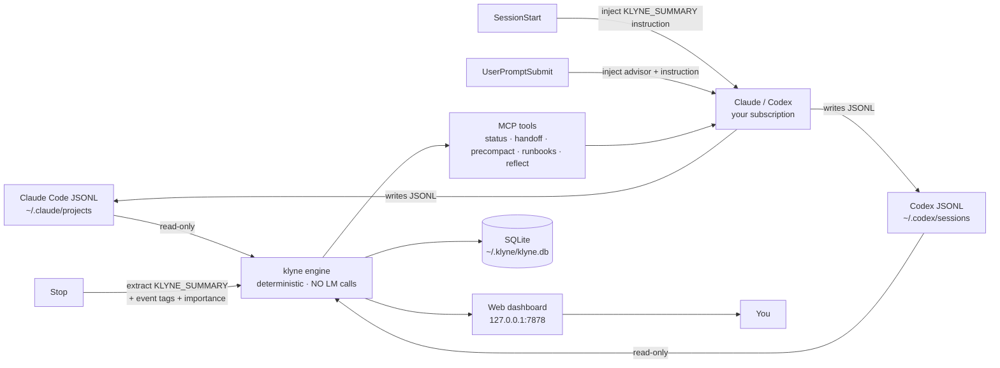

# klyne

> **The productivity layer for engineers who code with AI.**
> Local-first. No API keys. Works with Claude Code and Codex CLI.

[Install in 60 seconds](#install-in-60-seconds) · [How it works](#how-the-capture-works-without-burning-your-tokens) · [Day in the life](#a-day-in-the-life) · [How klyne is different](#how-klyne-is-different) · [Contributing](#contributing)

---

## The problem

AI coding tools like **Claude Code** and **OpenAI Codex CLI** have changed how we ship software. We now finish in an afternoon what used to take a week. We open three or four agentic sessions in parallel across different services. We make decisions, debug for hours, and merge PRs at a pace that would have been unimaginable two years ago.

But this new velocity has a hidden cost: **we've lost track of what we're actually doing.**

- *"What did I ship this week?"* — even you can't remember by Friday.
- *"How long did I really spend on that feature?"* — your Claude session shows turn counts, not focus hours.
- *"Which project burned through my token budget?"* — your AI bill is one big number with no project attribution.
- *"That important decision I made yesterday — where was it?"* — `/compact` ate the turn, and the AI can no longer see it.
- *"Did I already solve this last sprint?"* — the previous session is on disk as JSONL, but nothing surfaces it.

Existing tools each handle a slice. `ccusage` tells you total tokens. `claudestat` shows analytics for Claude. `claude-code-otel` exports OTel spans. `mcp-memory-keeper` stores decisions. Each is good at its slice. None of them answer the question that actually matters at the end of a hard week: **what did I ship, and what did it cost me?**

klyne answers that question — for both CLIs, on your laptop, without ever calling an extra model.

---

## What klyne does

1. **Captures every AI coding session automatically.** Reads the JSONL files Claude Code and Codex are already writing. No instrumentation, no SDK, no plugin in your code editor.
2. **Asks the AI to summarise its own work, inline.** A short instruction injected via Claude Code's `SessionStart` / `UserPromptSubmit` hooks tells the model to end each reply with a one-line summary. The Stop hook extracts it. Marginal cost: ~130 tokens per turn, billed to the subscription you already pay for.
3. **Scores every session 1–10** by event tags (commits landed, PRs opened, decisions recorded, migrations, security-relevant changes, …). Noise auto-suppresses; signal rises.
4. **Unifies Claude + Codex** in one timeline, one rollup, one weekly reflection. Cross-CLI by design.
5. **Surfaces hidden costs** — like the 90M-token subagent run your parent session's `cost_usd` never reported.
6. **Rescues you when context is lost** — pre-compact recovery, fresh-session handoff, 5-hour-window advisor, project + global runbooks consulted before risky shell commands.

Everything runs as a daemon bound to `127.0.0.1`. The SQLite store lives under `~/.klyne/`. No cloud. No telemetry. No proxy. **Zero AI subprocesses spawned by the daemon itself.**

---

## What you'll see

Once you've run `klyne mcp install` and ended a single Claude or Codex session, opening `http://127.0.0.1:7878` shows you four tabs:

### Worklog

One row per session. Auto-captured. Both CLIs interleaved.

```
This week so far · <N> sessions · <H>h <M>m focus · <C> commits · <P> PRs

★8  acme-api          (claude · 38m)  commit_landed
    "Added rate-limit middleware to /v1/users; tests green, opened PR #142."

★9  acme-frontend     (codex · 51m)   decision_recorded
    "Decided to migrate the auth flow to OAuth-PKCE; rollout plan in the PR description."

★7  acme-api          (claude · 22m)  error_resolved
    "Tracked the 502 in /v1/orders to a stale Redis pool; bumped max-conns and validated."

(low-signal sessions auto-suppressed — read-only greps, lint fixes, exploration)
```

Each row's prose summary is what **the model itself wrote** at the end of its reply. klyne didn't call a separate model to generate it.

### Insights

Productivity time (gap-capped active minutes, NOT screen-on time), token spend per project, model attribution, daily heatmap, streaks, top files, top tools, and hidden subagent cost rolled up to the parent.

```
30-day window · Claude + Codex combined

  Shipped              <commits> commits · <prs> PRs · <decisions> decisions
  Focused              <hours> active wall-clock (concurrency-merged across parallel agents)
  Spend by model       claude-opus-X  $<n>  · cache reuse <p>%
                       gpt-X-codex   $<n>
                       …
  Top projects (by your active minutes, NOT token count)
                       <project-a>   <h>h <m>m   ★ <imp> important sessions
                       <project-b>   <h>h <m>m   ★ <imp> important sessions

  Hidden costs surfaced
    <N> subagents · <T> tokens (<p>% cached) attributed back to parent session
    — invisible to the parent's `cost_usd`. klyne names them.
```

All numbers materialise from your own JSONL transcripts on first run; the template above is what the layout looks like, not someone else's data.

### Reflections

Friday afternoon, in any Claude or Codex session, you type `/klyne:reflect`. klyne hands the AI the deterministic rows for the week. **Your AI** writes the narrative — in the same chat, on the same subscription you were already using — with mandatory citations back to source `session_id`s. No second model running in the background.

### Work + Runbooks

- **Work** — live operational view (running sessions, project tiles, advisor signals).
- **Runbooks** — chat-first project / global ops-annotations. *"klyne remember this for project-X: ..."* writes a runbook; *"refer klyne and ..."* triggers automatic recall BEFORE the AI runs any operational shell command. Pre-execution recall is the killer feature here.

Press `/` anywhere for FTS5 search across every indexed session.

---

## How the capture works (without burning your tokens)

This is the part most productivity trackers get wrong. Generic trackers either:

- run a second model over your transcripts (burns extra API tokens),
- or beg you to write notes by hand (you won't).

klyne does neither. It uses three of Claude Code's standard hook events:

```
[ you press Enter in Claude / Codex ]
            │
            ▼
  ┌─────────────────────────────────────────────────────────┐
  │ 1. UserPromptSubmit hook (deterministic, local, ~5 ms)  │
  │    Injects ONE extra line into your prompt's context:   │
  │      "End your reply with KLYNE_SUMMARY: <≤100 words>   │
  │       or KLYNE_SUMMARY: skip."                          │
  └─────────────────────────────────────────────────────────┘
            │
            ▼
  ┌─────────────────────────────────────────────────────────┐
  │ 2. Your AI generates the reply you were going to get    │
  │    anyway — same chat, same subscription. The model     │
  │    naturally ends with one extra line of ~50 tokens.    │
  └─────────────────────────────────────────────────────────┘
            │
            ▼
  ┌─────────────────────────────────────────────────────────┐
  │ 3. Stop hook (deterministic, local, ~50 ms)             │
  │    Reads the JSONL the AI just wrote, regex-extracts    │
  │    the KLYNE_SUMMARY line, computes deterministic event │
  │    tags (commit, PR, decision, migration, security,     │
  │    error-resolved, …) + an importance score (1–10),     │
  │    writes one row to SQLite. NO MODEL CALL.             │
  └─────────────────────────────────────────────────────────┘
```

**Marginal cost: ~80 input + ~50 output tokens per turn — on the subscription you already pay for.** No API key. No proxy. No daemon-spawned subprocess. The "AI" in the loop is the same one you're already talking to.

For `claude --print` / one-shot / CI runs (which skip `UserPromptSubmit`), klyne uses the `SessionStart` hook to inject the same instruction. Both hooks together give 100% coverage of how people actually use Claude Code.

---

## A day in the life

**Monday, 9:00 AM.** Your laptop opens. You glance at `localhost:7878`. The Worklog tab shows the four important things you and your AI agents shipped Friday — files, decisions, the bug that took 45 minutes to track down. Total: 3 commits, 1 PR opened. *Yes, that's what last week was.*

**Monday, 11:00 AM.** You start a new Claude Code session in a fresh chat. Before your first prompt does anything, klyne's advisor surfaces the last 3 sessions in this project plus the runbook you told it to remember about the staging-vs-prod secret rotation. You don't have to re-explain anything.

**Monday, 3:30 PM.** You hit `/compact` because Claude is at 78% context. Two days later you'll need a path Claude wrote in the turn that got compacted away. `/klyne:precompact` reads it straight back out of the JSONL — verbatim, including the exact command you ran. The pre-compact slice was on disk all along; klyne just remembers where.

**Tuesday, 2:00 PM.** You spend two hours debugging a flaky migration. The AI writes one `KLYNE_SUMMARY: ...` line at the end of each turn. By the time you fix it, klyne has six tagged rows: `error_resolved`, `migration_or_schema_change`, importance 8. You don't have to write a status update — the dashboard already has one.

**Wednesday, 8:00 PM.** You spawn three parallel Claude Code agents on three services. klyne's Insights tab shows your **actual** wall-clock minutes (concurrency-merged — running three agents at once doesn't double-count) instead of pretending each agent's clock was its own.

**Friday, 4:45 PM.** You type `/klyne:reflect`. klyne hands your AI the week's deterministic rows. The AI writes the narrative — *"You shipped 3 features and 1 migration, made 2 architectural decisions, and spent 22 active hours across 4 projects. The big win was X; the open follow-up is Y; sessions 24, 31, 39 are the citations."* — in the same chat. You paste it into your standup. You go home.

That's the whole pitch.

---

## How klyne is different

We respect the prior art. Each of these tools is good at what it does — we learned from all of them. klyne's bet is that the **unified, cross-CLI, AI-writes-its-own-summary** angle is missing from the field:

| Tool | What it does | What klyne adds |
|---|---|---|
| [`ccusage`](https://github.com/ryoppippi/ccusage) | Total Claude token usage; CLI tables. | Cross-CLI (Claude + Codex), per-session prose, importance scoring, productivity time. |
| [`claudestat`](https://github.com/DeibyGS/claudestat) | Stats dashboard for Claude. | Codex parity, KLYNE_SUMMARY capture, weekly reflections, runbooks, /compact recovery. |
| [`claude-code-otel`](https://github.com/ColeMurray/claude-code-otel) | OTel exporter for Claude. | Dashboard + reflections + cross-CLI; klyne also has `klyne otel emit` if you want OTel out. |
| [`mcp-memory-keeper`](https://github.com/mkreyman/mcp-memory-keeper) | Decisions / memory MCP server. | Runbooks with pre-execution recall, project-scoped decisions, plus the productivity layer on top. |
| [`tokscale`](https://github.com/junhoyeo/tokscale) | Stats dashboard with heatmap. | Codex parity, AI-written per-turn prose, importance gating, /compact rescue. |
| Native Claude Code `/cost` | Current session cost. | Cross-session, cross-CLI, cross-day; surfaces subagent spend hidden from `cost_usd`. |

klyne overlaps where we genuinely think a single integrated surface is better than five separate tools. The CLI commands `klyne top` / `klyne patterns` / `klyne roast` are explicitly inspired by `claudestat`; `klyne files` is inspired by `token-dashboard`; `klyne otel emit` is inspired by `claude-code-otel`. All of them adapted to klyne's contracts: **local-first, deterministic, zero AI calls**.

---

## Install in 60 seconds

```bash
# Requires Go 1.25+ (the Makefile uses GOTOOLCHAIN=auto, so an older
# Go will fetch the right toolchain for you)
git clone https://github.com/klyne-ai/klyne && cd klyne
make build                              # produces ./bin/klyne and ./bin/klyne-hook

./bin/klyne mcp install                 # wires hooks + MCP into Claude / Codex
./bin/klyne config set plan max-5x      # optional: pro / max-5x / max-20x / team
./bin/klyne                             # start daemon + open http://127.0.0.1:7878
```

> ⚠️ **Restart Claude Code (and Codex CLI) after `klyne mcp install`.** Hooks and MCP servers only attach at session start.

That's it. Open a Claude session, do real work, end the session. Refresh the dashboard. There's your row.

Homebrew tap and one-line installer land with v0.1.

---

## Privacy model

klyne is built around four hard promises:

1. **Local-first.** Reads `~/.claude/projects/*.jsonl` and `~/.codex/sessions/*.jsonl` only. Stores SQLite under `~/.klyne/klyne.db`.
2. **No network calls.** The web UI binds to `127.0.0.1` (never `0.0.0.0`). The daemon makes no outbound HTTP requests.
3. **No telemetry.** klyne does not phone home. There is no opt-out because there is no opt-in.
4. **No LM subprocesses on the daemon side.** No `claude --print`, no `codex`, no `ollama`, no API key. Synthesis happens in your interactive Claude / Codex turn via the hooks above.

That fourth promise is structural, not policy. Earlier versions of klyne had a daemon-side AI runner. We tore it out — there are no provider constructors, no `summary_model` knobs, no API client wrapper anywhere in the code. The current architecture is **incapable** of charging your subscription without you seeing it as a normal turn in your own chat. See [`docs/SECURITY.md`](docs/SECURITY.md) for the full threat model.

---

## Architecture (the 5-minute version)



Two binaries:

- **`klyne`** (~22 MB) — daemon, CLI, web UI, MCP server.
- **`klyne-hook`** (~4 MB) — a tiny stub Claude Code invokes per hook event. Forwards over a Unix socket to the long-running daemon so the heavy binary stays warm (and macOS's jetsam never kills it under memory pressure).

When the daemon isn't running, `klyne-hook` transparently exec's the full binary as fallback. Hooks always fire.

---

## CLI reference

The web dashboard is the headline, but every surface has a CLI:

```bash
klyne tokens [--session=ID]              # per-turn token timeline + activity heatmap
klyne files [--mutated-only]             # per-file heat — Reads · Edits · Writes · Sessions
klyne top [--since=24h]                  # tool-call rankings
klyne patterns [--kind=…]                # tight-loop / bash-overuse / low-cache-reuse detection
klyne subagents [--since=24h]            # roll up Task-tool subagent spend to the parent
klyne decisions add | list | search      # immutable decisions log
klyne worklog export-week --project=PATH # commit a markdown digest to docs/worklog/
klyne statusline                         # one-liner for Claude Code's statusLine hook
klyne otel emit --out=spans.jsonl        # OTel-shaped spans, one per turn (file-only)
klyne audit-sessions --limit=20          # verify klyne's stored stats vs raw JSONL
```

All read-only over local JSONL + SQLite. None of these call a model.

---

## When things go wrong (the rescue suite)

Productivity tracking is the day job, but klyne started as a session rescue layer. Those features still ship — they're just no longer the headline:

| Slash | When it saves you |
|---|---|
| `/klyne:status` | Active session feels off — burning cache, drifting, accelerating. One Markdown payload with verdict + recommended action + bloat sources. |
| `/klyne:precompact` | `/compact` just buried the exact path / command / decision you needed. klyne reads it back from JSONL — verbatim. |
| `/klyne:handoff` | About to hit the 5-hour cap or your context window. Generates a deterministic Markdown handoff for the next session. |
| `/klyne:bootstrap` | Fresh chat, no memory. klyne assembles last 3 sessions + top runbooks + recent reflections in one brief. |
| Proactive advisor | Fires inline when stale-context / acceleration / 5-hour-window / hard-ceiling triggers cross thresholds. ~80-token warning, ≤4 per session. |

The two **provably klyne-only** features are pre-compact recovery (Claude literally cannot see those messages anymore) and the proactive advisor (Claude can't intercept its own input).

---

## Every claim above is a test

```bash
make proof                              # runs every reproducible-claim test under docs/proof/
node test/e2e/harness.mjs feature       # commit-driven session → importance ≥ 7
node test/e2e/harness.mjs bug           # prose-only finding → row exists
node test/e2e/harness.mjs decision      # decision recorded → row exists
node test/e2e/harness.mjs trivial       # trivial turn → suppressed
```

Each end-to-end scenario asserts **zero `claude --print` subprocesses spawned by the daemon**. If anyone ever wires a daemon-side AI call back in, the test fails red.

---

## Roadmap

We ship what's actually useful next, not what's furthest from done. In rough priority order:

- **v0.1** — Homebrew tap, one-line installer, signed binaries.
- **v0.2** — Codex `SessionStart` parity when the Codex API adds it.
- **v0.3** — VSCode / JetBrains extension surfacing the Worklog timeline + advisor inside the editor.
- **v0.4** — Team-mode opt-in (per-developer dashboards aggregated on the user's own machine; no cloud).
- **v0.5** — Plug-in hooks for other coding agents (Cursor, Continue, Aider) — same `KLYNE_SUMMARY` contract, different transcript format.

If you want something on this list sooner, [open an issue](https://github.com/klyne-ai/klyne/issues).

---

## Contributing

klyne is MIT-licensed and welcomes contributions from anyone who codes with AI day-to-day. The bar is:

- **Determinism.** No new daemon-side LM calls. No exceptions. (`/klyne:reflect` runs in the user's session — that's the only "AI does the talking" path, and the model is never the daemon's.)
- **Local-first.** No new outbound network calls. If a feature needs them, it has to be off-by-default and gated behind explicit config.
- **Cross-CLI.** New features land for both Claude Code and Codex CLI, or document the gap honestly.
- **Tested.** Every claim in the README has a Go test under `docs/proof/`. Every new feature carries one.

Start with:

- [`docs/FEATURES.md`](docs/FEATURES.md) — the complete feature reference grouped by real-world scenario.
- [`docs/proof/`](docs/proof/) — the reproducible-claim tests.
- [`docs/SECURITY.md`](docs/SECURITY.md) — the threat model.
- [`docs/QUESTIONS.md`](docs/QUESTIONS.md) — the per-command "why klyne, not just ask Claude?" rationale.

Issues, PRs, and design discussions are all welcome.

---

## What klyne does NOT claim

To stay honest:

- Doesn't reduce your interactive Claude / Codex token cost. It doesn't intercept the AI loop.
- Doesn't predict "you'll run out in N turns." Direction-only — claims you can't disprove are noise.
- Doesn't replace `/compact`. It lets you survive `/compact` without losing the bits you cared about.
- Doesn't call any model from the daemon. The only marginal cost is ~130 tokens per turn for the `KLYNE_SUMMARY` line, billed to your existing subscription.
- Doesn't replace a general focus tracker for non-AI work. klyne measures AI coding sessions specifically.

---

## License

MIT. See [LICENSE](LICENSE).
