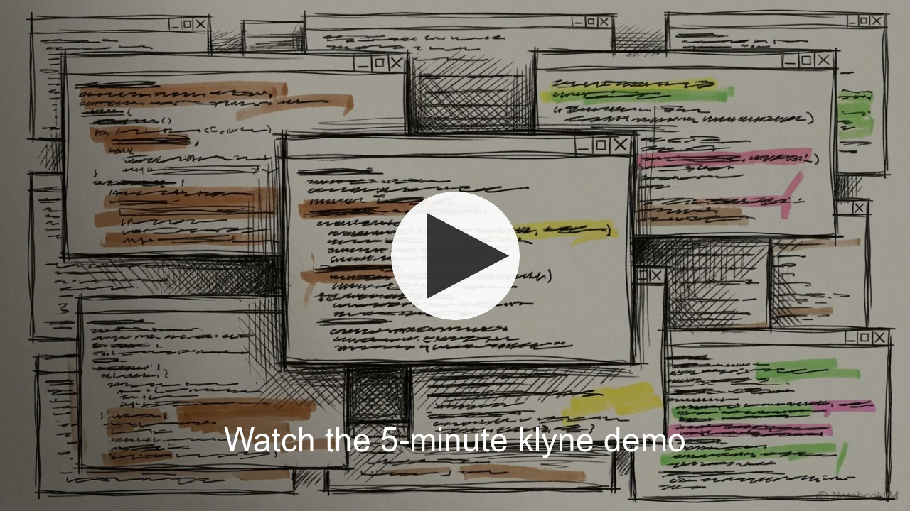

# klyne

> **The source of truth for what your AI session has actually done — including the parts the AI itself can no longer see.**

klyne is a local-first session rescue layer for Claude Code and Codex power users. It reads the JSONL files your AI coding tools already write — and gives you back the context that `/compact`, rate-limits, and fresh sessions destroy.

No cloud. No proxy. No telemetry. Read-only by design.

[](https://youtu.be/2NglEGlq3Ns)

[Watch the 5-minute klyne demo](https://youtu.be/2NglEGlq3Ns)

---

## What klyne solves

These are the pains every Claude Code / Codex power user hits weekly. **Each claim below is backed by a reproducible Go test** under [`docs/proof/`](docs/proof/) (or by a live CLI you can run against your own transcripts) — run `make proof` and watch them pass against real fixtures.

### 1. After `/compact`, your AI has lost context. klyne recovers it.

Anthropic's 5-hour rate-limit window doesn't end when you hit a hard limit — it ends earlier, when each turn becomes prohibitively expensive because the full conversation is being re-fed to the model. `/compact` is the official escape hatch, but it permanently deletes the original turns from the AI's view. The post-compact summary often misses the specifics that mattered: exact file paths, the regex literal you and the AI debugged, the off-the-cuff observation that turned out to be the bug.

**klyne's `get_pre_compact_context` reads the JSONL bytes the AI no longer has access to.** Same session, same transcript on disk, but klyne can return content the AI's view literally does not contain.

> **Proof:** [`docs/proof/01-compact-recovery/`](docs/proof/01-compact-recovery/) — synthetic Claude session about a bank-SMS regex bug. Twelve pre-compact messages, a `/compact`, two post-compact messages. The test asserts that high-signal strings (file paths, the user-verified `XX1234` mask, the exact npm command, the test result) appear in klyne's recovery output AND do **not** appear anywhere in the post-compact lines. **1165 bytes of conversational context recovered per fixture run** — content the AI would otherwise need re-input to know about.

### 2. Vanilla Claude's "summarise what we did" is variable; klyne's handoff is deterministic.

When you hit the rate-limit and need to bootstrap a fresh session, you typically ask the AI: *"summarise what we just did so I can paste it into a new chat."* That paragraph reads fine, but it varies turn-to-turn, glosses over the file paths and command stems the new session actually needs, and burns input tokens on something the AI already knows.

**klyne's `generate_handoff` reads the JSONL transcript and emits a structured Markdown prompt with fixed sections** — same input always produces the same output, every section a structured pull from the actual session events. Project path, files touched (with reuse counts), commands run, known failures, recent exchanges verbatim. Pass `scope=current-topic` to carry forward only files relevant to the user's most recent direction.

> **Proof:** [`docs/proof/02-handoff-equivalence/`](docs/proof/02-handoff-equivalence/) — synthetic webhook-retry session paused mid-task. Three assertions: every structural section is present and populated; rendering twice produces byte-identical output; files touched 3 times are marked `(×3)` so the new session knows which file is central. **Side-by-side with vanilla Claude's likely output is rendered in the claim doc.**

### 3. klyne pushes the verdict — you don't have to ask.

Pre-v0.5, you had to type `/klyne:health` to see whether your session was drifting. Now klyne installs a Claude Code `UserPromptSubmit` hook that checks four deterministic triggers on every prompt and injects a single one-line advisory inline when one fires.

The triggers, OR'd:

- **Stale-context** — more than half of the file bytes you've loaded are no longer relevant to your current direction (Jaccard between each file's anchor and your last five user messages). The advisory names the still-relevant subset so you know what to carry forward.
- **Acceleration** — your per-turn uncached input has roughly doubled over the last 3 turns vs the preceding 5. Direction-only — never "you'll exhaust in N turns."
- **Hard ceiling** — context fill ≥ 75%.
- **5-hour window** — across every Claude + Codex session in your home dir, you've used ≥ 50% (warn) or ≥ 75% (urgent) of your configured plan's effective-token cap.

Each trigger fires *once* per state transition, then stays silent until it clears. Lifetime cap of advisories per session is bounded at 4, so this is "interactive but not annoying."

Zero AI calls in the path. The advisory line is ~60–100 tokens, fixed-cost — same model as CLAUDE.md.

> **Proof:** [`docs/proof/03-advisor/`](docs/proof/03-advisor/) — four assertions covering each trigger plus the fire-once-per-transition contract. Run `make proof` and watch them pass.

### 4. You can see how this session has grown — every turn, cached vs uncached, on demand.

Most of klyne's tools fire on a trigger. The fourth surface is the one you reach for explicitly: `klyne tokens` (terminal) or `/klyne:tokens` (chat) renders a per-turn timeline of the active session — sparkline, time axis, and a Markdown table whose columns are `time`, `input tokens`, `% of context window`, `cached`, `uncached`. Every row makes the cache split explicit so `input == cached + uncached`, and the headline trajectory shows where the session started, peaked, and is now.

By default the view spans the **entire session**, even if it has been idle for hours. Pass `--window=30m` / `--window=5h` / `--window=2h30m` for a fixed-lookback view (e.g. focused on the last rate-limit burn).

Works for both Claude Code and Codex sessions. Codex's standalone `event_msg.token_count` records are projected onto the nearest-preceding assistant message at snapshot time so the timeline shape is identical across CLIs.

> **Verify on your own machine:** run `klyne tokens` from inside any project that has at least one Claude or Codex session. The full output is documented (with verbatim Claude+Codex examples against real sessions) in [`docs/cli-review-2026-05-10.md`](docs/cli-review-2026-05-10.md).

---

## See the proof yourself

```bash
# Clone, build, and run the reproducible proof
git clone https://github.com/klyne-ai/klyne && cd klyne
make build
make proof
```

`make proof` runs every test under `docs/proof/`. Each scenario has a fixture you can `cat`, a Go test you can read, and a `claim.md` with the exact side-by-side. **If any claim ever stops holding, the test fails red.** Marketing and code stay locked together by design.

---

## Real evidence (from your machine)

Once installed, run klyne against your own Claude/Codex transcripts:

```bash
klyne audit-sessions --limit 20
```

A real run on this maintainer's transcripts:

```text
Claude sessions sampled: 20
Token accuracy vs raw JSONL: 19/19 matched, 100%
/compact events found: 9
Sessions affected: 4
Context compacted away: ~3.3M tokens

One real session:
  Before /compact: 538,831 tokens
  After /compact:   14,875 tokens
  Compression:      36×
```

That ~3.3M tokens of "compacted away" context is exactly what `get_pre_compact_context` reads back from the JSONL.

---

## How it works


klyne runs in two complementary modes:

- **Local web cockpit** at `http://127.0.0.1:7878` — browse sessions, search messages across every project, inspect token usage, copy safe resume commands.
- **MCP session rescue server** — Claude Code (and Codex CLI) spawn it as a subprocess. The AI itself can call klyne's tools mid-session.

The MCP server is independent of the daemon. It reads JSONL directly so it works in fresh sessions before the daemon has had a chance to ingest them. **Only one tool — `search_messages` — depends on the daemon, because full-text search needs SQLite.**

---

## Install

Three ways to get the `klyne` binary onto your machine. Pick one.

### 1. Homebrew (macOS / Linux)

```bash
brew install klyne-ai/tap/klyne
```

This pulls the latest release formula from the [klyne-ai/homebrew-tap](https://github.com/klyne-ai/homebrew-tap) tap.

### 2. One-line install script (macOS / Linux)

```bash
curl -fsSL https://raw.githubusercontent.com/klyne-ai/klyne/init/scripts/install.sh | sh
```

Detects your OS + arch (darwin/linux × amd64/arm64), pulls the latest release archive from GitHub, verifies the sha256 against `checksums.txt`, and installs to `/usr/local/bin/klyne`.

Environment overrides:

- `KLYNE_VERSION=v0.5.0` — pin a specific release.
- `PREFIX=$HOME/.local/bin` — install somewhere else (no sudo needed).

### 3. Direct download from GitHub Releases

Grab the archive for your platform from [github.com/klyne-ai/klyne/releases/latest](https://github.com/klyne-ai/klyne/releases/latest):

- `klyne_<version>_darwin_amd64.tar.gz` / `_darwin_arm64.tar.gz`
- `klyne_<version>_linux_amd64.tar.gz` / `_linux_arm64.tar.gz`
- `klyne_<version>_windows_amd64.zip`

Verify with `checksums.txt` (sha256), extract, and move the `klyne` binary onto your `PATH`.

### Or build from source

```bash
# Requires Go 1.25+.
git clone https://github.com/klyne-ai/klyne && cd klyne
make build
# Binary lands at ./bin/klyne with the real git version baked in.
```

### After install: wire MCP + advisor hook

```bash
# Register the MCP server AND the proactive-advisor hook in Claude Code
# (and the MCP server in Codex). Idempotent: safe to re-run on every
# binary upgrade.
klyne mcp install

# Optional: enable the 5-hour-window advisor by selecting your plan tier.
# Without this, the other three triggers still work — only the
# 5-hour-window check stays silent.
klyne config set plan max-5x   # or pro / max-20x / team / custom

# Start the daemon + open the web UI
klyne
```

The `mcp install` command auto-detects host configs:

| Host | Config | Entry written |
|---|---|---|
| Claude Code | `~/.claude.json` | `mcpServers.klyne` |
| Codex CLI | `~/.codex/config.toml` | `[mcp_servers.klyne]` |

Pass `--platform claude` or `--platform codex` to scope the install.

---

## MCP surface

### Tools (auto-invoked by the AI)

| Tool | What it solves | When to use it |
|---|---|---|
| `list_sessions` | Enumerates Claude + Codex sessions in this project | Disambiguate between parallel terminals or `--resume` invocations |
| `get_context_health` | Classifies a session as `healthy` / `drifting` / `risky` / `rescue_now` plus a bloat scorecard | Before compacting or continuing a long task |
| `search_messages` | Full-text search across every indexed session | "Where did we discuss X two weeks ago?" — requires daemon running |
| `generate_handoff` | Deterministic Markdown handoff prompt for fresh sessions; optional `scope=current-topic` carries forward only relevant files | When you've hit your rate-limit and need to start over |
| `get_pre_compact_context` | Recovers messages preceding the last `/compact` (Claude) or `replacement_history` (Codex) | When the compact summary lost important details |
| `get_token_timeline` | Per-turn token usage for one session — sparkline + table with `time / input / % of context / cached / uncached` columns. Spans the entire session by default; pass `window=30m` / `window=5h` / `window=2h30m` to narrow. | "How much of my context window have I burned, and how did it grow?" |

### Slash prompts (user-triggered via `/` menu in Claude Code)

| Slash command | What it runs |
|---|---|
| `/klyne:health` | Live `get_context_health` |
| `/klyne:sessions` | Live `list_sessions` |
| `/klyne:search` | Live `search_messages` (takes a `query` argument) |
| `/klyne:handoff` | Live `generate_handoff` |
| `/klyne:precompact` | Live `get_pre_compact_context` |
| `/klyne:tokens` | Live `get_token_timeline` — ASCII sparkline + per-turn table for the active session, full lifetime by default |

`klyne mcp install` writes these as both MCP prompts (host-native) **and** markdown slash commands under `~/.claude/commands/klyne/*.md`. The markdown form is what Claude Code v2.1.x actually fires when you press Enter on a slash dropdown — no special action needed; just type `/klyne:health` (etc.) and submit. The MCP-prompt form remains in place so older / future Claude Code builds and other MCP hosts (e.g. Codex CLI) keep working through the host-native path.

---

## Supported CLIs

| Surface                     | Claude Code | Codex                    |
|-----------------------------|-------------|--------------------------|
| `list_sessions`             | ✅          | ✅                       |
| `get_context_health`        | ✅          | ✅                       |
| `search_messages`           | ✅          | ✅                       |
| `generate_handoff`          | ✅          | ✅                       |
| `get_pre_compact_context`   | ✅ via `compact_boundary` lines | ✅ via embedded `replacement_history` |
| `get_token_timeline`        | ✅          | ✅                       |
| `klyne advise` (advisor hook) | ✅        | n/a (no UserPromptSubmit hook surface) |

For Codex sessions, `pre_tokens` and `trigger` (manual/auto) fields are not exposed in the output — Codex's `compacted` envelope doesn't carry that metadata. The recovered messages themselves are returned identically.

---

## CLI commands

`klyne` ships with these top-level subcommands. The MCP surface (above) and these CLI commands share the same engine — you can run any read-only operation either from chat (slash menu) or from your terminal.

| Command | What it does |
|---|---|
| `klyne` (no args) | Start the daemon (alias for `klyne start`). Opens `http://127.0.0.1:7878`. |
| `klyne start` / `klyne stop` | Daemon lifecycle. |
| `klyne doctor` | JSON diagnostic — paths, providers, schema version, DB size. |
| `klyne audit-sessions [--limit N]` | Compare klyne's stored metrics against raw JSONL ground truth across N most-recent sessions. The trust foundation. |
| `klyne mcp install` | Register the MCP server in Claude Code + Codex configs AND install the `UserPromptSubmit` advisor hook. Idempotent. |
| `klyne advise` | Hook entrypoint. You don't run this directly; Claude Code's hook runs it. |
| `klyne config show / get / set <key>` | Read or update `~/.klyne/config.toml`. Two keys today: `plan` (`pro` / `max-5x` / `max-20x` / `team` / `custom --cap=N` — drives the 5-hour-window advisor's denominator) and `advisor` (`on` / `off` — kill switch for the UserPromptSubmit hook). |
| `klyne tokens [--session=ID] [--window=DURATION]` | Per-turn token timeline for one session: sparkline, per-row `cached` / `uncached` columns, freshness anchor. **Spans the entire session by default**; pass `--window=30m` / `--window=5h` / `--window=2h30m` for a focused-lookback view. Same output as `/klyne:tokens` in chat. |
| `klyne top [--project=PATH] [--since=24h] [--limit=N] [--json]` | Tool-usage rankings across sessions — most-called tool, share of total, error count, sessions seen in. |
| `klyne patterns [--kind=tight_loop\|bash_overuse\|low_cache_reuse] [--json]` | Deterministic inefficiency detection: same-tool loops, Bash overuse, low cache reuse — with severity. |
| `klyne roast [--max=N] [--json]` | Templated, deterministic zingers about your usage. No AI calls — every line is interpolated from real numbers in your local DB. |

The three analytics commands (`top`, `patterns`, `roast`) are inspired by [claudestat](https://github.com/DeibyGS/claudestat). They re-use klyne's existing SQLite store — read-only, deterministic, zero network traffic.

A 2026-05-10 review of every command's behaviour against a real Claude session and a real Codex session, with verdicts on what's useful and what isn't, lives at [docs/cli-review-2026-05-10.md](docs/cli-review-2026-05-10.md).

---

## What klyne does *not* claim

To stay honest:

- **klyne does NOT reduce Claude's per-turn token cost.** It doesn't intercept the AI loop.
- **klyne does NOT save a guaranteed % of your rate-limit budget.** The savings depend on whether you would otherwise have re-explained the lost context — varies by user and session.
- **klyne does NOT replace `/compact`.** Use `/compact` when you need it; klyne lets you survive it without losing recoverable context.
- **klyne does NOT call any AI model in the core flow.** Every tool here is deterministic over JSONL bytes. The optional summary/title features in the web UI are BYOK and clearly gated.

---

## Privacy model

klyne is local-first:

- reads local JSONL transcripts;
- stores local SQLite data under `~/.klyne/`;
- binds the web UI to `127.0.0.1`;
- never uploads or proxies conversations;
- never writes to the source transcript files.

Optional AI features (summary, title generation, etc.) require your own provider key. Core audit, MCP rescue, search, and handoff features are deterministic and do not require an AI API key.

---

## Quick start

1. **Build:** `make build` (binary lands at `./bin/klyne` with the real git version baked in)
2. **Install MCP + advisor hook:** `./bin/klyne mcp install`. Idempotent — it registers the MCP server in Claude Code (`~/.claude.json`) and Codex (`~/.codex/config.toml`), AND wires the `UserPromptSubmit` advisor hook into `~/.claude/settings.json`.
3. **(Optional) Pick your plan tier** so the 5-hour-window advisor has a denominator: `./bin/klyne config set plan max-5x` (or `pro` / `max-20x` / `team` / `custom --cap=<tokens>`). The other three advisor triggers work without this.
4. **Restart Claude Code** so it picks up the new MCP server, slash prompts, and the advisor hook. (Existing MCP subprocesses keep their old binary in memory — you must restart for upgrades to take effect.)
5. **Run the daemon:** `./bin/klyne` (opens `http://127.0.0.1:7878` in your browser).
6. **Verify trust:** `./bin/klyne audit-sessions --limit 20` (compares klyne's stored metrics against raw JSONL — Claude DB + JSONL accuracy + Codex JSONL ground truth).
7. **See your session's token usage at any time:** `./bin/klyne tokens` from inside any project, or `/klyne:tokens` inside a Claude Code chat. Default view is the entire session; `--window=Xh` narrows it.

To silence the advisor for a noisy session (e.g. when you're developing klyne itself or otherwise know what you're doing), run `./bin/klyne config set advisor off`. Re-enable with `... advisor on`. The hook entry stays installed either way; the gate lives in `klyne advise` itself, so toggling is instant.

---

## Documentation

- [Reproducible proof index](docs/proof/) — every claim, with a fixture and a Go test
- [Compact-recovery proof](docs/proof/01-compact-recovery/claim.md) — side-by-side vs vanilla Claude
- [Handoff-equivalence proof](docs/proof/02-handoff-equivalence/claim.md) — verbatim handoff output
- [Proactive advisor proof](docs/proof/03-advisor/claim.md) — four triggers + transition rule
- [Proactive session advisor design](docs/features/proactive-session-advisor.md) — v1 spec for the UserPromptSubmit hook
- [CLI review (2026-05-10)](docs/cli-review-2026-05-10.md) — every CLI command tested against real Claude + Codex sessions, with honest verdicts
- [MCP ship log](docs/MCP-SHIP-LOG.md) — every slice that landed, in order
- [Context rescue strategy](docs/marketing/context-rescue-strategy.md)
- [Comparison and gaps](docs/marketing/comparison-and-gaps.md)
- [Security model](docs/SECURITY.md)

---

## License

MIT. See [LICENSE](LICENSE).
